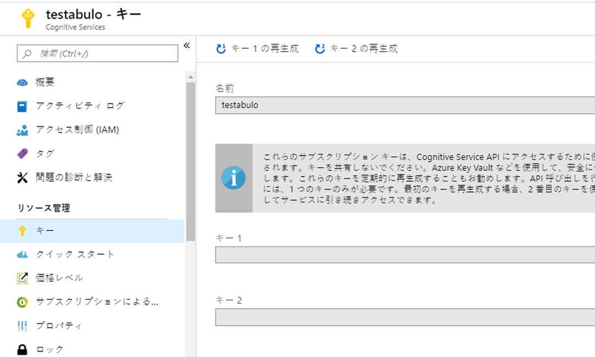

---
lab:
    title: 'ラボ 2: Computer Vision の実装'
    module: 'モジュール 1: Azure Cognitive Services の概要'
---

# ラボ 2: Computer Vision の実装

## ラボ 2.0: 目的

このラボでは、次の内容を学習します。

- さまざまな Cognitive Services API について学習する
- Cognitive Services を呼び出すアプリを構成する方法を理解する
- .NET アプリケーションでさまざまな Cognitive Services API (特に Computer Vision) を呼び出すアプリケーションを構築する

Cognitive Services に重点を置きますが、Visual Studio 2017 Community Edition も利用します。

> 注: まだ Azure アカウントと Cognitive Services を作成して Computer Vision キーを取得していない場合は、[Lab1-Technical_Requirements.md](../Lab1-Technical_Requirements/02-Technical_Requirements.md) の指示に従ってください。

## 概要

自分の写真を取り込み、Cognitive Services を使用して画像に関するキャプションとタグを取得することを可能にするエンドツーエンドのアプリケーションを構築します。後半のラボでは、LUIS を使用して、画像に対して簡単なターゲットを絞ったクエリを実行できる Bot Framework ボットを構築します。

## ラボ 2.1: アーキテクチャ

ローカル ドライブから画像を取り込み、[Computer Vision API](https://www.microsoft.com/cognitive-services/ja-jp/computer-vision-api) を呼び出して画像を分析し、タグと説明を取得できる単純な C# アプリケーションを構築します。

このコースのこのラボの続きでは、データのクエリを実行し、そのクエリを実行する [Bot Framework](https://dev.botframework.com/) ボットを構築する方法について説明します。最後に、[LUIS](https://www.microsoft.com/cognitive-services/ja-jp/language-understanding-intelligent-service-luis) を使用してこのボットを拡張し、クエリから意図を自動的に抽出し、それらを使用して検索をインテリジェントに指示します。


> このラボは、[Cognitive Services チュートリアル](https://github.com/noodlefrenzy/CognitiveServicesTutorial)を変更したものです。

## ラボ 2.2: リソース

[メイン](./) コース フォルダーには、次の 2 つのディレクトリがあります。

- **コード**: ここには、使用するいくつかのディレクトリがあります。
  - **Starting-ImageProcessing** と **Finished-ImageProcessing**: 開始用のフォルダーがあり、ラボを実行する場合に使用する必要がありますが、行き詰まった場合や、時間がなくなった場合のために、完了したフォルダーもあります。各フォルダーには、ラボ用に複数の異なるプロジェクトがあるソリューション (.sln) が含まれています。
    - **ProcessingLibrary**: これは、Vision に関連するさまざまな Cognitive Services にアクセスするためのヘルパー クラスと、結果をカプセル化するためのいくつかの "Insights" クラスが含まれるポータブル クラス ライブラリ (PCL) です。

- **sample_images**: Cognitive Services の実装のテストに使用するいくつかのサンプル画像。

### はじめに

Azure アカウントと Cognitive Services を作成し、Computer Vision キーを取得するには、[Lab1-Technical_Requirements.md](../Lab1-Technical_Requirements/02-Technical_Requirements.md) の指示に従ってください。

このラボを通して、Cognitive Services キーとストレージ キーを収集します。将来のラボで簡単にアクセスできるように、すべてのファイルをテキスト ファイルとして保存する必要があります。

**Cognitive Services API キーの取得**

Portal で、使用する Cognitive Services のキーを作成します。主に [Computer Vision](https://www.microsoft.com/cognitive-services/ja-jp/computer-vision-api) Cognitive Services を使用するので、最初に API キーを作成しましょう。

Portal で **+ New** ボタンをクリックし (その上にカーソルを合わせると、[**リソースの作成**] と表示される)、検索ボックスに「**computer vision**」と入力し、「**Computer Vision API**」を選択します。


作成する API エンドポイントの詳細を入力し、目的の API と、エンドポイントを配置する場所 (**!!米国西部リージョンにしてください。そうしないと、動作しません!!**)、目的の料金プランを選択します。チュートリアルに必要なスループットを確保するために、**S1** を使用します。見つけやすいように、_ダッシュボードにピン留め_します。Computer Vision API では、将来の Cognitive Services Vision サービスを改善するためにマイクロソフト社内に (安全な方法で) 画像を保存するため、リソースを作成する前に、これを承諾することを示すチェックボックスをオンにする必要があります。

**米国西部に Computer Vision サービスを配置することを再確認する**

> 次のラボのコードでは、Computer Vision API を呼び出すために米国西部を使用するように設定されています。今後、[ここ](https://docs.microsoft.com/ja-jp/azure/cognitive-services/Computer-vision/Vision-API-How-to-Topics/HowToSubscribe)で他のリージョンを呼び出す方法を学習できます。




>注: 作成する Cognitive Services API ごとに 2 つのキーがあります。どちらかが動作します。複数のキーの詳細については、[ここ](https://blogs.msdn.microsoft.com/mast/2013/11/06/why-does-an-azure-storage-account-have-two-access-keys/)を参照してください。

## ラボ 2.3: 画像処理

## Cognitive Services

Cognitive Services を使用すると、アプリ、Web サイト、ボットにアルゴリズムを組み込み、自然なコミュニケーション方法によってユーザーのニーズの確認、聞く、話す、理解、解釈を行えます。

利用可能な Cognitive Services には、主に次の 5 つのカテゴリがあります。
- **ビジョン**: 画像を識別、キャプション、モデレートする画像処理アルゴリズム
- **知識**: インテリジェントな推奨事項やセマンティック検索などのタスクを解決するために、複雑な情報とデータをマッピングします
- **言語**: あらかじめ構築されたスクリプトを使用してアプリで自然言語を処理し、センチメントを評価し、ユーザーが望むものを認識する方法を学習できます
- **スピーチ**: 話された音声をテキストに変換したり、検証に音声を使用したり、アプリに話者認識を追加したりします
- **検索**: アプリに Bing Search API を追加し、1 回の API 呼び出しで数十億の Web ページ、画像、ビデオ、ニュースを検索する機能を利用します

[Services ディレクトリ](https://azure.microsoft.com/ja-jp/services/cognitive-services/directory/)内の特定の API をすべて参照できます。

ご存知のように、本日構築しているアプリケーションでは、[Computer Vision](https://www.microsoft.com/cognitive-services/ja-jp/computer-vision-api) を使用してタグと説明を取得します。

アプリケーションで Cognitive Services を呼び出す方法について説明します。

### **画像処理ライブラリ**###

ソリューション内の`code/Starting-ImageProcessing`の下に、`処理ライブラリ`があります。これは[ポータブル クラス ライブラリ (PCL)](https://docs.microsoft.com/ja-jp/dotnet/standard/cross-platform/cross-platform-development-with-the-portable-class-library) で、クロスプラットフォーム アプリとライブラリをすばやく簡単に構築するのに役立ちます。処理ライブラリは、いくつかのサービスのラッパーとして機能します。この特定の PCL には、Computer Vision API にアクセスするためのヘルパー クラス (ServiceHelpers フォルダー内) と、結果をカプセル化する "ImageInsights" クラスが含まれています。後で画像をラッピングし、Cognitive Services へのブリッジとして機能するいくつかのメソッドとプロパティを公開する画像プロセッサ クラスを作成します。


画像プロセッサを作成 (ラボ 2.4) した後で、このポータブル クラス ライブラリを取得し、Cognitive Services が含まれる他のプロジェクトにドロップできます (使用する Cognitive Services に応じて変更が必要)。


**ProcessingLibrary: サービス ヘルパー**

サービス ヘルパーを使用すると、アプリの開発が容易になります。サービス ヘルパーで行う重要なことの 1 つは、API 呼び出しで call-rate-exceeded エラーが返されたことを検出し、(少しの遅延後に) 呼び出しを自動的に再試行する機能を提供することです。また、サービス ヘルパーはメソッドの取り込み、例外の処理、およびキーの処理にも役立ちます。

[インテリジェント キオスクのサンプル アプリケーション](https://github.com/Microsoft/Cognitive-Samples-IntelligentKiosk/tree/master/Kiosk/ServiceHelpers)には、その他のいくつかの Cognitive Services に対する追加のサービス ヘルパーがあります。これらのリソースを利用すると、必要に応じて将来のプロジェクトでサービス ヘルパーを簡単に追加したり、削除したりできます。


**ProcessingLibrary: "ImageInsights" クラス**

"ImageInsights" クラスを見てみましょう。ご覧のように、画像から`キャプション」と「タグ`、一意の`ImageId`を要求しています。「ImageInsights」では、Computer Vision API (複数の呼び出しを選択した場合は、Cognitive Services) から必要な情報だけをまとめます。

ここで少し脱線します。これは、"ImageInsights" クラスを作成してサービス ヘルパーからいくつかのメソッドをコピーしたり、エラーを処理したりするほど簡単ではありません。API を呼び出して、どこかで画像を処理する必要があります。このラボでは`ImageProcessor.cs`の作成について順を追って説明しますが、今後のプロジェクトでは、このクラスを PCL に追加して開始ポイントにします (呼び出している Cognitive Services と、処理している対象 (画像、テキスト、音声など) に応じて変更が必要)。


## ラボ 2.4: `ImageProcessor.cs`の作成

まだ行っていない場合は、`code/Starting-ImageProcessing`に移動して、`Processing Library`を見つけます。

ソリューションを右クリックし、「ソリューションのビルド」を選択します。現在対策を講じていますので、`ImageProcessor.cs`に関連するエラーが発生しても、現時点ではそのエラーを無視してください。

`ProcessingLibrary`内の`ImageProcessor.cs`に移動します。

**手順 1**: 次の[`using`ディレクティブ](https://docs.microsoft.com/ja-jp/dotnet/csharp/language-reference/keywords/using-directive)を、名前空間の上のクラスの**先頭**に追加します。

```csharp
using System;
using System.IO;
using System.Linq;
using System.Threading.Tasks;
using Microsoft.ProjectOxford.Vision;
using ServiceHelpers;
```

[Project Oxford](https://blogs.technet.microsoft.com/machinelearning/tag/project-oxford/) は、多くの Cognitive Services が開始されているプロジェクトです。ご覧のとおり、Project Oxford の下に、NuGet パッケージがラベル付けされています。このシナリオでは、Computer Vision API 用の`Microsoft.ProjectOxford.Vision`を呼び出します。さらに、サービス ヘルパーを参照します (繰り返しますが、これによって作業が容易になります)。アプリケーションで利用する Cognitive Services に応じて、さまざまなパッケージを参照する必要があります。

**手順 2**: `ImageProcessor.cs`で、まず画像の処理に使用するメソッド`ProcessImageAsync`を作成します。`ImageProcessor`クラス内 (`{」と「}`の間) に次のコードを貼り付けます。

```csharp
public static async Task<ImageInsights> ProcessImageAsync(Func<Task<Stream>> imageStreamCallback, string imageId)
        {


```

> ヒント: ブラケットが閉じられていないと、Visual Studio でエラーがスローされます。メソッドの最後に必要なものを追加します。ヘルプが必要な場合は、周りのユーザーに尋ねてください。

上記のコードでは、画像を複数回処理できることを確認するため (必要なサービスごとに 1 回)、`Func<Task<Stream>>`を使用しています。Func では、ストリームを取得する方法を返すことができます。ストリームの取得は通常、非同期操作であり、Func でストリーム自体を返すわけではないため、非同期で行うことを可能にするタスクが返されます。

**手順 3**: `ImageProcessor.cs`で、`ProcessImageAsync`メソッド内に、プロセッサを通して入力する[静的配列](https://stackoverflow.com/questions/4594850/definition-of-static-arrays)を設定します。ご覧のとおり、これらは`ImageInsights.cs`に対して呼び出す主な属性です。`ProcessImageAsync`の`{」と「}`の間に以下のコードを追加します。

```csharp
VisualFeature[] DefaultVisualFeaturesList = new VisualFeature[] { VisualFeature.Tags, VisualFeature.Description };
```

**手順 4**: 次に、Cognitive Service (Computer Vision) を呼び出して、結果を`imageAnalysisResult`に格納します。以下のコードを使用して、(`VisionServiceHelper.cs`を利用して) Computer Vision API を呼び出し、結果を`imageAnalysisResult`に格納します。`VisionServiceHelper.cs`の下の方で、呼び出すことができるメソッドを確認します (`RunTaskWithAutoRetryOnQuotaLimitExceededError`、`DescribeAsync`、`AnalyzeImageAsync`、`RecognizeTextAsyncYou`)。視覚的特徴を返すために、AnalyzeImageAsync メソッドを使用します。

```csharp
var imageAnalysisResult = await VisionServiceHelper.AnalyzeImageAsync(imageStreamCallback, DefaultVisualFeaturesList);
```

**手順 5**: これまでに Computer Vision サービスを呼び出しました。次の結果だけが含まれる "ImageInsights" にエントリを作成します。ImageId、キャプション、タグ (`ImageInsights.cs`を再参照することで確認できます)。`var imageAnalysisResult`の下に次のコードを貼り付け、`ImageId`、`キャプション`、および`タグ`のコードを入力します。


```csharp
            ImageInsights result = new ImageInsights
            {
                ImageId = imageId,
                Caption = imageAnalysisResult.Description.Captions[0].Text,
                Tags = imageAnalysisResult.Tags.Select(t => t.Name).ToArray()
            };
```


これで、Computer Vision API から必要なキャプションとタグが取得され、各画像の結果 (imageId 付き) が "ImageInsights" に格納されます。

**手順 6**: 最後に、メソッドの末尾に次の行を追加して、メソッドを閉じる必要があります。

```csharp
return result;
```

これで`ImageProcessor.cs`が構築されました。忘れずに保存してください!

`ImageProcessor.cs`を正しく設定したことを確認するには、どうすればいいでしょうか? 完全なクラスは、[ここ](./code/Finished-ImageProcessing/ProcessingLibrary/ImageProcessor.cs)で確認できます。

## 2.5_TestCLI

## Cosmos DB の探索

Azure Cosmos DB はマイクロソフトの回復性の高い NoSQL PaaS ソリューションであり、画像メタデータの結果と同様に、緩やかに構造化されたデータを格納するのに非常に便利です。他にも選択肢 (Azure Table Storage、SQL Server) がありますが、Cosmos DB ではスキーマを自由に進化させ (新しいサービスへのデータの追加など)、簡単にクエリを実行し、Azure Search にすばやく統合するための柔軟性がもたらされます (後のラボで実習)。

### ラボ 2.6 (オプション): CosmosDBHelper について
Cosmos DB はこのラボの焦点ではありませんが、ご興味がある方のために、使用するコードのハイライトの一部をご紹介します。

- `ImageStorageLibrary`の`CosmosDBHelper.cs`クラスに移動します。コードとコメントを確認します。使用される実装の多くについては、[スタート アップガイド](https://docs.microsoft.com/ja-jp/azure/cosmos-db/documentdb-get-started)を参照してください。
- `TestCLI''Util.cs`に移動し、`ImageMetadata`クラス (コードとコメント) を確認します。ここで、Cognitive Services から取得した`ImageInsights`を適切なメタデータに変換し、Cosmos DB に格納します。
- 最後に、`TestCLI`の`Program.cs`と`ProcessDirectoryAsync`を見てみましょう。まず、画像とメタデータが既にアップロードされていることを確認します。`CosmosDBHelper`を使用して ID でドキュメントを検索します。ドキュメントが存在しない場合は`null`が返されます。次に、`forceUpdate`を設定しているか、または画像がまだ処理されていない場合は、`ProcessingLibrary`から`ImageProcessor`を使用して Cognitive Services を呼び出し、現在の`ImageMetadata`に追加する`ImageInsights`を取得します。  

すべてが完了すると、画像を格納できます。まず、`BlobStorageHelper`インスタンスを使用して実際の画像を BLOB Storage に格納し、次に`CosmosDBHelper`インスタンスを使用して`ImageMetadata`を Cosmos DB に格納します。(これまでに確認したように) ドキュメントが既に存在している場合、既存のドキュメントを更新する必要があります。存在していない場合は、新しいドキュメントを作成する必要があります。

### ラボ 2.7: TestCLI を使用した画像の読み込み

イベント ループ、フォーム、その他の UX 関連の中断を心配することなくコードの処理に集中できるように、メインの処理コードとストレージ コードをコマンド ライン/コンソール アプリケーションとして実装します。後で独自の UX を自由に追加してください。

_TestCLI_ の`settings.json`で Cognitive Services API キー、Azure Blob Storage 接続文字列、および Cosmos DB エンドポイントの URI およびキーを設定したら、_TestCLI_ を実行できます。

_TestCLI_ を実行し、コマンド プロンプトを開いて、このラボのアプリケーション用の Debug フォルダーに移動します。次に、`TestCLI.exe`と入力します。以下の結果が得られるはずです。

```
    > TestCLI.exe

    Usage:  [options]

    オプション：
    -force            ファイルが既に追加されている場合でも、更新を強制するために使用します。
    -Settings         設定ファイル (オプション。設定されていない場合、埋め込まれたリソースの settings.json を使用します)
    -Process          処理するディレクトリ
    -query            実行するクエリ
    -?  | -h | --Help  ヘルプ情報を表示します
```

既定では、`settings.json`から設定が読み込まれます (`.exe`にビルド)。`-settings`フラグを使用して独自の設定を指定することもできます。画像 (および Cognitive Services のメタデータ) をクラウド ストレージに読み込むには、次のように画像ディレクトリに対して`-process`を実行するように _TestCLI_ に指示するだけです。

> <%GitHubDir%> の値を、リポジトリのクローンを作成したフォルダーに置き換えます。

```
    > TestCLI.exe -process <%GitHubDir%>\AI-100-Design-Implement-Azure-AISol\Lab2-Implement_Computer_Vision\sample_images
```

処理が完了したら、次のように _TestCLI_ を使用して Cosmos DB に対して直接クエリを実行できます。

```
    > TestCLI.exe -query "select * from images"
```

少し時間を取ってサンプル画像 (/sample_images にあります) を調べて、画像をアプリケーション内の結果と比較します。
