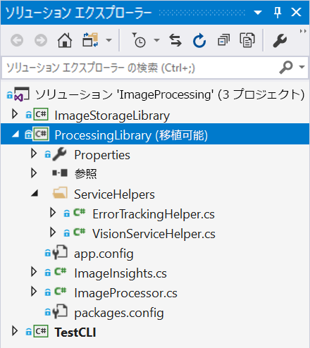

# ラボ 2 - Computer Vision を実装する

## 紹介

自分の写真を取り込み、Cognitive Services を使用して画像に関するキャプションとタグを取得することを可能にするエンドツーエンドのアプリケーションを構築します。後半のラボでは、LUIS を使用して、画像に対して簡単なターゲットを絞ったクエリを実行できる Bot Framework ボットを構築します。

## ラボ 2.0: 目的

このラボでは、次の内容を学習します。

- さまざまな Cognitive Services API について学習する
- Cognitive Services を呼び出すアプリを構成する方法を理解する
- .NET アプリケーションでさまざまな Cognitive Services API (特に Computer Vision) を呼び出すアプリケーションを構築する

Cognitive Services に重点を置きますが、Visual Studio 2019 も利用します。

> 注: まだ Azure アカウントと Cognitive Services を作成して api キーを取得していない場合は、[Lab1-Technical_Requirements.md](../Lab1-Technical_Requirements/02-Technical_Requirements.md) の指示に従ってください。

## ラボ 2.1: アーキテクチャ

ローカル ドライブから写真を取り込み、[Computer Vision API](https://www.microsoft.com/cognitive-services/ja-jp/computer-vision-api) を呼び出して画像を分析し、タグと説明を取得できる簡単な C# アプリケーションをビルドします。

このコースのこのラボの続きでは、データのクエリを実行し、そのクエリを実行する [Bot Framework](https://dev.botframework.com/) ボットを構築する方法について説明します。最後に、[LUIS](https://www.microsoft.com/cognitive-services/ja-jp/language-understanding-intelligent-service-luis) を使用してこのボットを拡張し、クエリから意図を自動的に抽出し、それらを使用して検索をインテリジェントに指示します。


## ラボ 2.2: リソース

[メイン](https://github.com/MicrosoftLearning/AI-100-Design-Implement-Azure-AISol/blob/master/Lab2-Implement_Computer_Vision/) github リポジト リフォルダーにはいくつかのディレクトリがあります。

- **sample_images**: Cognitive Services の実装のテストに使用するいくつかのサンプル画像。

- **code**: ここには 2 つのディレクトリがあります。各フォルダーには、ラボ用に複数の異なるプロジェクトで構成されるソリューション (.sln) が含まれています。

  - **スタータ**: プロジェクトで使用されているコードの作成方法について学習する場合に使用できるスタータ プロジェクト。

  - **終了**: コンピュータビジョンを実装し、このラボのイメージを操作するために使用する完了プロジェクト。

## ラボ 2.3: 画像処理

### Cognitive Services

Cognitive Services を使用すると、アプリ、Web サイト、ボットにアルゴリズムを組み込み、自然なコミュニケーション方法によってユーザーのニーズの確認、聞く、話す、理解、解釈を行えます。

利用可能な Cognitive Services には、主に次の 5 つのカテゴリがあります。

- **Vision**: 画像を識別、キャプション、モデレートする画像処理アルゴリズム
- **知識**: インテリジェントな推奨事項やセマンティック検索などのタスクを解決するために、複雑な情報とデータをマッピングします
- **言語**: あらかじめ構築されたスクリプトを使用してアプリで自然言語を処理し、センチメントを評価し、ユーザーが望むものを認識する方法を学習できます
- **スピーチ**: 話された音声をテキストに変換したり、検証に音声を使用したり、アプリに話者認識を追加したりします
- **検索**: アプリに Bing Search API を追加し、1 回の API 呼び出しで数十億の Web ページ、画像、ビデオ、ニュースを検索する機能を利用します

[Services ディレクトリ](https://azure.microsoft.com/ja-jp/services/cognitive-services/directory/)内の特定の API をすべて参照できます。

アプリケーションで、終了したプロジェクト内のサンプル コードを確認し、Cognitive Services を呼び出す方法について説明します。

### 画像処理ライブラリ

1. **code/Finished/ImageProcessing.sln** ソリューションを開きます

`ImageProcessing`ソリューション内の、`ProcessingLibrary`プロジェクトを探します。処理ライブラリは、いくつかのサービスのラッパーとして機能します。この特定の PCL には、Computer Vision API にアクセスするためのヘルパー クラス (ServiceHelpers フォルダー内) と、結果をカプセル化する "ImageInsights" クラスが含まれています。



このポータブル クラス ライブラリを取得し、Cognitive Services が含まれる他のプロジェクトにドロップできます (使用する Cognitive Services に応じて変更が必要)。

**ProcessingLibrary: サービス ヘルパー**

サービス ヘルパーを使用すると、アプリの開発が容易になります。サービス ヘルパーで行う重要なことの 1 つは、API 呼び出しで call-rate-exceeded エラーが返されたことを検出し、(少しの遅延後に) 呼び出しを自動的に再試行する機能を提供することです。また、サービス ヘルパーはメソッドの取り込み、例外の処理、およびキーの処理にも役立ちます。

[インテリジェント キオスクのサンプル アプリケーション](https://github.com/Microsoft/Cognitive-Samples-IntelligentKiosk/tree/master/Kiosk/ServiceHelpers)には、その他のいくつかの Cognitive Services に対する追加のサービス ヘルパーがあります。これらのリソースを利用すると、必要に応じて将来のプロジェクトでサービス ヘルパーを簡単に追加したり、削除したりできます。

**ProcessingLibrary: "ImageInsights" クラス**

1. **ProcessingLibrary** プロジェクトで、**ImageInsights.cs** ファイルに移動します。

ご覧のように、画像から`Caption`、`Tags`、および一意の`ImageId`のプロパティを確認できます。「ImageInsights」は、Computer Vision APIから情報を収集します。

ここで少し脱線します。これは、"ImageInsights" クラスを作成してサービス ヘルパーからいくつかのメソッドをコピーしたり、エラーを処理したりするほど簡単ではありません。API を呼び出して、どこかで画像を処理する必要があります。このラボでは、`ImageProcessor.cs`の詳細を確認し、その使用方法を理解します。今後のプロジェクトでは、このクラスを PCL に追加して開始ポイントにします (呼び出している Cognitive Services と、処理している対象 (画像、テキスト、音声など) に応じて変更が必要)。

## ラボ 2.4: `ImageProcessor.cs`を確認します。

1. `ProcessingLibrary`内の **ImageProcessor.cs** に移動します。

1. 注: 次の[`using`ディレクティブ](https://docs.microsoft.com/ja-jp/dotnet/csharp/language-reference/keywords/using-directive)を、名前空間の上のクラスの**先頭**に追加してください。

```csharp
using System;
using System.IO;
using System.Linq;
using System.Threading.Tasks;
using Microsoft.ProjectOxford.Vision;
using ServiceHelpers;
```

[Project Oxford](https://blogs.technet.microsoft.com/machinelearning/tag/project-oxford/) は、多くの Cognitive Services が開始されているプロジェクトです。ご覧のとおり、Project Oxford の下に、NuGet パッケージがラベル付けされています。このシナリオでは、Computer Vision API 用の`Microsoft.ProjectOxford.Vision`を呼び出します。さらに、サービス ヘルパーを参照します (繰り返しますが、これによって作業が容易になります)。アプリケーションで利用する Cognitive Services に応じて、さまざまなパッケージを参照する必要があります。

1. **ImageProcessor.cs**で、最初に画像の処理に使用するメソッド`ProcessImageAsync`を作成します。このコードは、サービスを使用してアクションを実行するため、非同期処理を使用します。

```csharp
public static async Task<ImageInsights> ProcessImageAsync(Func<Task<Stream>> imageStreamCallback, string imageId)
{
	// プロセッサの過程で入力する配列を設定します。
  VisualFeature[] DefaultVisualFeaturesList = new VisualFeature[] { VisualFeature.Tags, VisualFeature.Description };

  // Computer Vision を呼び出し、結果を imageAnalysisResult に格納します。
  var imageAnalysisResult = await VisionServiceHelper.AnalyzeImageAsync(imageStreamCallback, DefaultVisualFeaturesList);

  // ImageInsights で次のエントリを作成します。
  ImageInsights result = new ImageInsights
  {
  	ImageId = imageId,
    Caption = imageAnalysisResult.Description.Captions[0].Text,
    Tags = imageAnalysisResult.Tags.Select(t => t.Name).ToArray()
  };

  // 次の結果を返します。
  return result;
}
```

上記のコードでは、画像を複数回処理できることを確認するため (必要なサービスごとに 1 回)、`Func<Task<Stream>>`を使用しています。Func では、ストリームを取得する方法を返すことができます。ストリームの取得は通常、非同期操作であり、Func でストリーム自体を返すわけではないため、非同期で行うことを可能にするタスクが返されます。

`ImageProcessor.cs`で、`ProcessImageAsync`メソッド内に、プロセッサ全体に入力する[静的配列](https://stackoverflow.com/questions/4594850/definition-of-static-arrays)を設定します。ご覧のとおり、これらは`ImageInsights.cs`に対して呼び出す主な属性です。

1. 次に、Cognitive Service (Computer Vision) を呼び出して、結果を`imageAnalysisResult`に格納します。

1. 以下のコードを使用して (`VisionServiceHelper.cs`を利用) Computer Vision API を呼び出し、結果を`imageAnalysisResult`に格納します。`VisionServiceHelper.cs`の下の方で、呼び出すことができるメソッドを確認します (`RunTaskWithAutoRetryOnQuotaLimitExceededError`、`DescribeAsync`、`AnalyzeImageAsync`、`RecognizeTextAsyncYou`)。視覚的特徴を返すために、AnalyzeImageAsync メソッドを使用します。

```csharp
var imageAnalysisResult = await VisionServiceHelper.AnalyzeImageAsync(imageStreamCallback, DefaultVisualFeaturesList);
```

これまでに Computer Vision サービスを呼び出しました。次の結果だけが含まれる "ImageInsights" にエントリを作成します。ImageId、キャプション、タグ (`ImageInsights.cs`を再参照することで確認できます)。

1. 次のコードでこれを完了させます。

```csharp
ImageInsights result = new ImageInsights
{
    ImageId = imageId,
    Caption = imageAnalysisResult.Description.Captions[0].Text,
    Tags = imageAnalysisResult.Tags.Select(t => t.Name).ToArray()
};
```

これで、Computer Vision API から必要なキャプションとタグが取得され、各画像の結果 (imageId 付き) が "ImageInsights" に格納されます。

1. 最後に、メソッドの末尾に次の行を追加して、メソッドを閉じる必要があります。

```csharp
return result;
```

1. このアプリケーションを使用するには、プロジェクトをビルドし、**Ctrl + Shift +B** を一緒に押して、「**ビルド**」メニューから「**ソリューションのビルド**」を選択します。

1. 講師と一緒にエラーを修正します。

### Cosmos DB の探索	

Azure Cosmos DB はマイクロソフトの回復性の高い NoSQL PaaS ソリューションであり、画像メタデータの結果と同様に、緩やかに構造化されたデータを格納するのに非常に便利です。他にも選択肢 (Azure Table Storage、SQL Server) がありますが、Cosmos DB ではスキーマを自由に進化させ (新しいサービスへのデータの追加など)、簡単にクエリを実行し、Azure Search にすばやく統合するための柔軟性がもたらされます (後のラボで実習)。	

## ラボ 2.5 (オプション): CosmosDBHelper について	

Cosmos DB はこのラボの焦点ではありませんが、ご興味がある方のために、使用するコードのハイライトの一部をご紹介します。	
1. `ImageStorageLibrary`プロジェクトの`CosmosDBHelper.cs`クラスに移動します。コードとコメントを確認します。使用される実装の多くについては、[スタート アップガイド](https://docs.microsoft.com/ja-jp/azure/cosmos-db/documentdb-get-started)を参照してください。	
1. `TestCLI`プロジェクトの`Util.cs`に移動し、`ImageMetadata`クラス (コードとコメント) を確認します。ここで、Cognitive Services から取得した`ImageInsights`を適切なメタデータに変換し、Cosmos DB に格納します。	
- 最後に、`TestCLI`の `Program.cs` と`ProcessDirectoryAsync`を見てみましょう。まず、画像とメタデータが既にアップロードされていることを確認します。`CosmosDBHelper`を使用して ID でドキュメントを検索します。ドキュメントが存在しない場合は`null`が返されます。次に、`forceUpdate`を設定しているか、または画像がまだ処理されていない場合は、`ProcessingLibrary`から`ImageProcessor`を使用して Cognitive Services を呼び出し、現在の`ImageMetadata`に追加する`ImageInsights`を取得します。  	
- すべてが完了すると、画像を格納できます。まず、`BlobStorageHelper`インスタンスを使用して実際の画像を BLOB Storage に格納し、次に`CosmosDBHelper`インスタンスを使用して`ImageMetadata`を Cosmos DB に格納します。(これまでに確認したように) ドキュメントが既に存在している場合、既存のドキュメントを更新する必要があります。存在していない場合は、新しいドキュメントを作成する必要があります。	

## ラボ 2.6: TestCLI を使用した画像の読み込み	

イベント ループ、フォーム、その他の UX 関連の中断を心配することなくコードの処理に集中できるように、メインの処理コードとストレージ コードをコマンド ライン/コンソール アプリケーションとして実装します。後で独自の UX を自由に追加してください。	
1. **TestCLI** プロジェクトで、 **settings.json** ファイルを開きます	
1. [Lab1-Technical_Requirements.md](../Lab1-Technical_Requirements/02-Technical_Requirements.md) から特定の環境設定を追加します	

> **注**: プロジェクト oxford api の場合、Cognitive Services の URL は **/vision/v1.0** で終わります。  たとえば、`https://westus2.api.cognitive.microsoft.com/vision/v1.0` などです。	

1. まだコンパイルしていない場合は、プロジェクトをコンパイルします。	
1. コマンドプロンプトを開き、 **TestCLI** プロジェクトのビルドディレクトリに移動します。  **{GitHubDir}\Lab2-Implement_Computer_Vision\code\Finished\TestCLI** のようになります。

> **注**: デバッグ ディレクトリに移動しないでください
> **注**: .net core 2.2 は、インストールが必要です。こちら https://dotnet.microsoft.com/download/dotnet-core/2.2 でご覧になれます。	

1. 実行コマンド **dotnet run**	
```cmd	
Usage:  [options]	
Options:	
-force            ファイルが既に追加されている場合でも、更新を強制するために使用します。	
-Settings         設定ファイル (オプション。設定されていない場合、埋め込まれたリソースの settings.json を使用します)	
-Process          処理するディレクトリ	
-query            実行するクエリ	
-?  | -h | --Help  ヘルプ情報を表示します	
```	
既定では、`settings.json`から設定が読み込まれます (`.exe`にビルドされます) が、`-settings`フラグを使用して独自の設定を指定することもできます。イメージ (および Cognitive Services のメタデータ) をクラウド ストレージに読み込むには、次のようにイメージ ディレクトリに対して`-process`を実行するように _TestCLI_ に指示するだけです。	
```cmd	
dotnet run -- -process <%GitHubDir%>\AI-100-Design-Implement-Azure-AISol\Lab2-Implement_Computer_Vision\sample_images	
```	
> **注**: <%GitHubDir%> の値を、リポジトリのクローンを作成したフォルダーに置き換えます。	
処理が完了したら、次のように _TestCLI_ を使用して Cosmos DB に対して直接クエリを実行できます。	
```cmd	
dotnet run -- -query "select * from images"	
```	
少し時間を取ってサンプル画像 (/sample_images にあります) を調べて、画像をアプリケーション内の結果と比較します。	
> **注**: Azure の CosmosDB リソースで結果を参照することもできます。  リソースを開き、「**データ エクスプローラー**」を選択します。 **メタデータ** データベースを展開し、「**items**」 （項目) ノードを選択します。  結果を含む json ドキュメントが複数表示されます。


## クレジット

このラボは、この [Cognitive Services チュートリアル](https://github.com/noodlefrenzy/CognitiveServicesTutorial)を変更したものです。

## リソース

- [Computer Vision API](https://www.microsoft.com/cognitive-services/ja-jp/computer-vision-api)
- [Bot Framework](https://dev.botframework.com/)
- [Services Directory](https://azure.microsoft.com/ja-jp/services/cognitive-services/directory/)
- [Portable Class Library (PCL)](https://docs.microsoft.com/ja-jp/dotnet/standard/cross-platform/cross-platform-development-with-the-portable-class-library)
- [Intelligent Kiosk サンプルアプリケーション](https://github.com/Microsoft/Cognitive-Samples-IntelligentKiosk/tree/master/Kiosk/ServiceHelpers)

## 次のステップ

- [ラボ 03-01: 基本フィルター ボット](../Lab3-Basic_Filter_Bot/01-Introduction.md)
