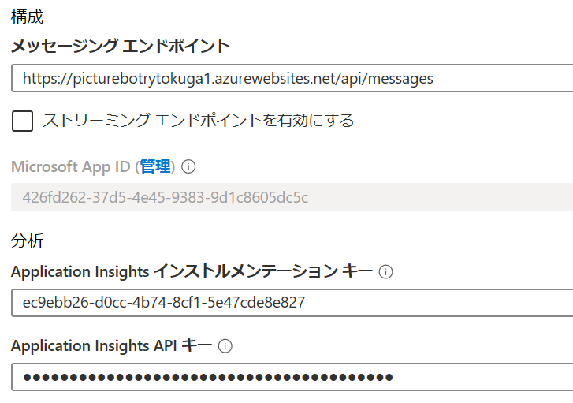
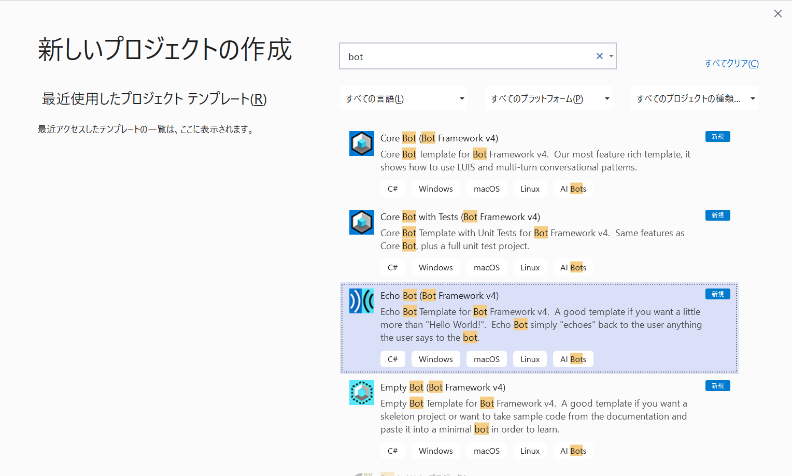

# 課題 3: 基本的なフィルタリング ボットを作成する

## 紹介

新たに登場する技術はどれも、それがもたらす機会と同じぐらい多くの疑問点が伴います。そして、AI を活用する技術には、固有の考慮事項があります。
AI ツールを設計して実装するときは、次の AI 倫理の原則を常に念頭に置いてください。

1. *公平性*: 効率を最大化するために尊厳を傷つけてはならない
1. *説明責任*: AI はそのアルゴリズムに責任を持つ必要がある
1. *透明性*: 偏見や、人間の尊厳の破壊を許してはならない
1. *倫理的な応用*: AI は人類を支援するものであり、インテリジェントにプライバシーを守る設計でなければならない

インテリジェントなアプリを構築するときの倫理面に関する考慮事項について、[詳しい説明](https://ai-ethics.azurewebsites.net/)を読むことをお勧めします。

## 前提条件

1. [Lab1-Technical_Requirements.md](../Lab1-Technical_Requirements/02-Technical_Requirements.md) に記載されている手順に従って v4 Bot Framework Emulator をダウンロードします。これは、ボットをローカルでテストできるようにするためです。

## ラボ 3.0 Azure Webアプリボットの作成

Microsoft Bot Framework を使用して作成されたボットは、パブリック アクセス可能な任意の URL でホストできます。  このラボの目的のために、[Azure Bot Service](https://docs.microsoft.com/ja-jp/bot-framework/bot-service-overview-introduction) を使用してボットを登録します。

1. [Azure portal](https://portal.azure.com) に移動します

1. ポータルでリソースグループに移動し、「**+追加**」をクリックして**ボット**を検索します。

1. 「**Web App Bot**」を選択して「**作成**」をクリックします。

1. 名前用に、一意の識別子を作成する必要があります。PictureBot[i][n] のような規則にすることをお勧めします。[i] は自分のイニシャルで、[n] は数字です (例: PictureBotamt6)。

1. リージョンを選択します。

1. 価格レベルの場合は、**F0 (10K プレミアム メッセージ)** を選択します。

1. ボット テンプレート領域の選択

1. **C＃**を選択し、次に**Echo Botを**選択します。後でPictureBotに更新します。

    

1. 「**OK**」をクリックして、「**Echo Bot**」が表示されていることを確認します。

1. 新しい App Service プランを構成します (ボットと同じ場所に配置する)。

1. Application Insights をオンにするかどうかを選択できます。

1. 「**アプリ ID とパスワードの自動作成**」は変更もクリックも**しないでください**。これは後で設定します。

1. 「**作成**」を選択します

1. デプロイされたら、新しい Azure Web アプリボットリソースに移動します。

1. 「**ボット管理で**」、「**設定**」をクリックします

1. 「**Microsoft App ID**」の「**管理**」リンクをクリックします



1. 「**新しいクライアント シークレット**」をクリックします

1. 名前に「**PictureBot**」と入力します

1. 有効期限については、「**しない**」を選択します

1. 「**追加**」を選択します

1. シークレットをメモ帳などに記録し、後でラボで使用できるようにします。

1. 「**概要**」をクリックし、後でラボでアプリケーション ID をメモ帳または同様の情報に記録します。

1. 「**Webアプリボット**」リソースに戻り、「**ボット管理**」の下の「**Webチャットでテスト**」タブを選択します

1. 起動したら、何ができるかを調べます。  ご覧のとおり、メッセージをエコー バックするだけです。


## ラボ 3.1: 単純なボットを作成して実行する

1. **ビジュアル スタジオ 2019**以降を開く

1. 「**新しいプロジェクトの作成**」をクリックし、**ボット**を検索します。

1. **Echo Bot (Bot Framework v4)** が表示されるまで下にスクロールします。

>注意:
>インストールされている Visual Studio のバージョンによっては、以下のスクリーンショットは独自のものと異なる場合があります。  Echo Bot テンプレートに複数のバージョンが表示されている場合は、バージョン 2.1 ではなくバージョン 3.1 を選択します。



1. 「**次へ**」を選択します

> **注意:** エコー ボット テンプレートが表示されない場合は、req 前の手順から Visual Studio アドインをインストールする必要があります。

1. 名前に「**PictureBot**」と入力し、「**作成**」をクリックします

1. Echo Bot テンプレートから生成されるさまざまなものをすべて見てみましょう。個々のファイルについて説明することはしませんが、**後で**少し時間を取ってこのサンプル (ともう 1 つの Web App Bot サンプル - Basic Bot) を実際に試して精査することを**強くお勧めします** (まだの場合)。この中には、ボット開発に必要となる、重要で有用なシェルがあります。これとその他の有用なシェルやサンプルは、[ここ](https://github.com/Microsoft/BotBuilder-Samples)にあります。

1. まず、ソリューションを右クリックして「**ビルド**」を選択します。これにより、ナゲット パッケージが復元されます。

1. **appsettings.json** ファイルを開き、上記で記録したボット サービス情報を追加して更新します。

```json
{
    "MicrosoftAppId": "YOURAPPID",
    "MicrosoftAppPassword": "YOURAPPSECRET"
}
```

1. ご存知とは思いますが、Visual Studio のソリューション/プロジェクトの名前を変更することは、きわめて注意を要する作業です。**慎重に**次のタスクを行って、すべての名前に EchoBot の代わりに PictureBot が反映される状態にしてください。

1. **Bots / Echobot.cs** ファイルを右クリックし、[**名前の変更**]を選択して、クラス ファイルの名前を **PictureBot.cs** に変更します。

1. プロンプトが表示されない場合は、クラスの名前を手動で変更してから、クラスのすべての参照を **PictureBot** に変更する必要があります。  プロジェクトをビルドしようとすると、見逃したかどうかがわかります。

1. プロジェクトを右クリックして、「 **Nuget Packagaesの管理** 」を選択します

1. 「**参照**」タブをクリックし、次のパッケージをインストールします。バージョン **4.6.3** を使用していることを確認してください。

* Microsoft.Bot.Builder.Azure
* Microsoft.Bot.Builder.AI.Luis
* Microsoft.Bot.Builder.Dialogs
* Microsoft.Azure.Search (バージョン、10.1.0 以降)

1. ソリューションをビルドします。

>**ヒント**:  モニターが 1 台だけの場合に手順の説明と Visual Studio を簡単に切り替えるために、手順ファイルを Visual Studio ソリューションに追加できるようになりました。それには、ソリューション エクスプローラーでプロジェクトを右クリックし、**「追加」 > 「既存の項目」** を選択します。「Lab2」に移動し、種類が 「MD ファイル」 のすべてのファイルを追加します。

### Hello World ボットを作成する

ラボの今後の部分で使用する命名と NuGet パッケージをサポートするように基本シェルの更新が完了したので、カスタム コードの追加を開始する準備ができました。最初に、V4 SDK を使用するボット開発のウォームアップとしてシンプルな 「Hello worl」 ボットを作成します。

重要な概念の 1 つが `"ターン"` です。これは、ユーザーへのメッセージとボットからの応答を表すのに使用されます。
たとえば、ユーザーが「ハロー、ボット」と言ってボットが「こんにちは、お元気ですか?」と答えると、これが **1 つの**ターンとなります。次の画像で、1 つの**ターン**がボット アプリケーションの複数のレイヤーをどのように通過するかを確認してください。


1. **PictureBot.cs** ファイルを開きます。  

1. 次のコードを使用して、`OnMessageActivityAsync` メソッドを確認します。このメソッドは、会話のたびに呼び出されます。このことが重要である理由は後で分かりますが、ここでは OnMessageActivityAsync がすべてのターンで呼び出されることを覚えておいてください。

1. **F5**を押してデバッグを開始します。

次のことに**注意してください**。

* default.htm (wwwroot の下) ページがブラウザーに表示されます。

* Web ページのローカルホスト ポート番号に注目してください。これは、Emulator のエンドポイントと一致しているはずです (一致する必要があります)。

>行き詰まってしまったときは? このラボのこの時点までのソリューションは、[{GitHubPath}/code/Finished/PictureBot-Part0](./code/Finished/PictureBot-Part0) にあります。このソリューション内の readme ファイルを開くと、ソリューションを実行するためにどのキーの追加が必要かがわかります。

#### Bot Framework Emulator を使用する

ボットと対話するには:

* Bot Framework Emulator を起動します (このラボでは v4 Emulator を使用します)。  「**スタート**」をクリックし、「**Bot Emulator**」を検索します。

* ようこそページで、「**新しいボット構成の作成**」を選択します

* 名前に「**PictureBot**」と入力します

* ボット Web ページに表示される URL を入力します。

* Appsettings.json に入力した AppId と App Secret を入力します

> **注**: ボット設定にidとsecretの値を入力しない場合は、ボットエミュレーターに値を入力する必要もありません。

* 「**保存して接続**」をクリックし、.bot ファイルをローカルに保存します。

* この時点で、ボットと会話できる状態になっています。

* **Hello** と入力します。ボットは、先ほど作成した Azure ボットに似たメッセージをエコーして応答します。

> **注** 「会話の再開」を選択して、会話履歴をクリアできます。


ログの中に、次のような行があるはずです。


これは、ngrok がローカル アドレスに対してバイパスされることを示しています。このワークショップでは ngrok を使用しませんが、仮に一般公開版のボットに接続するとしたら、"production" エンドポイントを介して接続します。この "production" エンドポイントを開き、各環境でのボットの違いを観察してください。これは、開発版ボットをテストして本番ボットと比較するときに役立つ機能です。

Emulator の使い方の詳細については、[ここ](https://docs.microsoft.com/ja-jp/azure/bot-service/bot-service-debug-emulator?view=azure-bot-service-4.0)を参照してください。

1. サンプルのボット コードのファイルの内容を調べます。特に、

* **Startup.cs** は、サービス/ミドルウェアを追加し、HTTP 要求パイプラインを構成するのに使用するファイルです。この中に多数存在するコメントは、何が行われるのかを理解するのに役立ちます。少し時間を取って読んでみてください。

* **PictureBot.cs**: `OnMessageActivityAsync` メソッドは、ユーザーからのメッセージを待つエントリ ポイントです。ここで、受信したメッセージに反応して、さらにメッセージを待つことができます。  `turnContext.SendActivityAsync` を使用して、ボットからユーザーにメッセージを返すことができます。

## ラボ 3.2:  状態とサービスの管理

1. **Startup.cs**ファイルに再度移動します

1. `using` ステートメントのリストに次の行を**追加**します。

```csharp
using System;
using System.Linq;
using System.Text.RegularExpressions;
using Microsoft.Bot.Builder.Integration;
using Microsoft.Bot.Configuration;
using Microsoft.Bot.Connector.Authentication;
using Microsoft.Extensions.Options;
using Microsoft.Extensions.Logging;
using Microsoft.PictureBot;

using Microsoft.Bot.Builder.AI.Luis;
using Microsoft.Bot.Builder.Dialogs;
```

上記の名前空間はまだ使用しませんが、いつ使うかを考えてみてください。

1. **Startup.cs** クラスで、`ConfigureServices` メソッドに注目してください。これは、ボットにサービスを追加するのに使用されます。内容を精査して、何が自動的にビルドされるかを見つけてください。

> より深く理解するための追加の注意事項:
>
> * 依存関係挿入については、[こちらの詳しい説明](https://docs.microsoft.com/ja-jp/aspnet/web-api/overview/advanced/dependency-injection)を参考にしてください。
> * このラボとテストの目的では、ローカル メモリを使用できます。本番運用には、[状態データを管理する](https://docs.microsoft.com/ja-jp/azure/bot-service/bot-builder-storage-concept?view=azure-bot-service-4.0)方法を実装する必要があります。`ConfigureServices` の中のまとまったコメント行に、このヒントがあります。
> * このメソッドの一番下で、状態アクセサーを作成して登録していることに気付いたでしょうか。状態の管理は、インテリジェントなボットを作成するための鍵です。[詳しくは、こちらを参照してください](https://docs.microsoft.com/ja-jp/azure/bot-service/bot-builder-dialog-state?view=azure-bot-service-4.0)。

幸い、このシェルは非常に包括的なので、2つの項目を追加するだけでｓます。

* ミドルウェア
* カスタム状態アクセサー

### ミドルウェア

ミドルウェアは、単一のクラスまたはクラスの集合で、アダプターとボット ロジックの間に存在し、アダプターのミドルウェアのコレクションに初期化時に追加されます。

SDK を使用して、開発者は独自のミドルウェアをプログラミングすることや、他者が作成したミドルウェアの再利用可能コンポーネントを追加することができます。ボットに出入りするすべてのアクティビティは、ミドルウェアを通って流れます。これについては、このラボで後ほど詳しく取り上げますが、現時点で理解しておいてほしいのは、どのアクティビティもミドルウェアを通って流れるということです。その理由は、ミドルウェアが `ConfigureServices` メソッドの中に存在し、このメソッドが実行時に呼び出されるからです (ユーザーと `OnMessageActivityAsync` によって送信されるすべてのメッセージの間で実行されます)。

1. **ミドルウェア**という名前の新しいフォルダを追加する

1. 「**Middleware**」フォルダーを右クリックして、**「追加」>「既存の項目」** を選択します。

1. **{GitHubDir}\Lab3-Basic_Filter_Bot\code\Middleware** に移動し、3つのファイルをすべて選択して、「**追加**」 を選択します

1. **Startup** クラスに次の変数を追加します。

```csharp
private ILoggerFactory _loggerFactory;
private bool _isProduction = false;
```

1. **ConfigureServices** メソッドの次のコードを置き換えます。

```csharp
services.AddTransient<IBot, PictureBot.Bots.PictureBot>();
```

with the following code:

```csharp
services.AddBot<PictureBot.Bots.PictureBot>(options =>
{
    var appId = Configuration.GetSection("MicrosoftAppId")?.Value;
                var appSecret = Configuration.GetSection("MicrosoftAppPassword")?.Value;

                options.CredentialProvider = new SimpleCredentialProvider(appId, appSecret);

    // アプリケーションが使用するロガーを作成します。
    ILogger logger = _loggerFactory.CreateLogger<PictureBot.Bots.PictureBot>();

    // 会話のターン中に発生したエラーをキャッチし、ログに記録します。
    options.OnTurnError = async (context, exception) =>
    {
        logger.LogError($"Exception caught : {exception}");
        await context.SendActivityAsync("Sorry, it looks like something went wrong.");
    };

    // ここで使用されるメモリストレージは、ローカルボットのデバッグ専用です。ボットが
    // 再起動すると、メモリに保存されていたものはすべてなくなります。
    IStorage dataStore = new MemoryStorage();

    // 運用ボットの場合、Azure Blob を使用するか、
    // Azure CosmosDB ストレージ プロバイダーを使用します。Azure ベースの
    // ストレージ プロバイダーの場合は、Microsoft.Bot.Builder.Azure
    // Nugetパッケージをソリューションに追加します。パッケージは次の場所にあります。
    // https://www.nuget.org/packages/Microsoft.Bot.Builder.Azure/
    // Azure BLOB ストレージを使用するには、次の行のコメントを解除します。
    // //.botファイルのストレージ構成名またはID。
    // const string StorageConfigurationId = "<STORAGE-NAME-OR-ID-FROM-BOT-FILE>";
    // var blobConfig = botConfig.FindServiceByNameOrId(StorageConfigurationId);
    // if (!(blobConfig is BlobStorageService blobStorageConfig))
    // {
    //    throw new InvalidOperationException($"The .bot file does not contain an blob storage with name '{StorageConfigurationId}'.");
    // }
    // //デフォルトのコンテナ名。
    // const string DefaultBotContainer = "botstate";
    // var storageContainer = string.IsNullOrWhiteSpace(blobStorageConfig.Container) ? DefaultBotContainer : blobStorageConfig.Container;
    // IStorage dataStore = new Microsoft.Bot.Builder.Azure.AzureBlobStorage(blobStorageConfig.ConnectionString, storageContainer);

    // 会話状態オブジェクトを作成します。
    // 会話状態オブジェクトは、会話スコープで何かを永続化する場所です。
    var conversationState = new ConversationState(dataStore);

    options.State.Add(conversationState);

    var middleware = options.Middleware;
    // ミドルウェアをこの下に "middleware.Add(...." で追加する
    // この下に正規表現を追加する
});
```

1. **Configure** メソッドを次のコードに置き換えます。

```csharp
public void Configure(IApplicationBuilder app, IHostingEnvironment env, ILoggerFactory loggerFactory)
{
    _loggerFactory = loggerFactory;

    app.UseDefaultFiles()
        .UseStaticFiles()
        .UseBotFramework();

    app.UseMvc();
}
```

#### カスタム状態アクセサー

必要なカスタム状態アクセサーについて説明する前に、背景情報が重要です。ダイアログ (次のセクションで説明します) は、マルチターン会話ロジックを実装するためのアプローチの 1 つです。この場合は、ユーザーが現在会話のどこにいるかを知るために、永続化された状態に依存する必要があります。このラボで作成するダイアログ ベースのボットでは、DialogSet を使用してさまざまなダイアログを保持します。この DialogSet を作成するには、"アクセサー" と呼ばれるオブジェクトへのハンドルを使用します。

アクセサーは、SDK の中にある `IStatePropertyAccessor` インターフェイスを実装します。これによって、状態に関する情報の取得、設定、削除ができるようになります。したがって、開発者はユーザーが会話の中のどのステップにいるかを追跡することができます。

作成するアクセサーのそれぞれについて、最初にプロパティ名を指定する必要があります。このラボでは、次のものを追跡します。

1. `PictureState`
    * 既にユーザーに挨拶したか?
        * 挨拶を 2 回以上する必要はありませんが、会話の最初に確実に挨拶する必要があります。
    * ユーザーは現在特定の単語を検索しているか? もしそうなら、それは何か?
        * ユーザーが何を探しているかをこちらに伝えてくれたかどうか、伝えてくれた場合はそれが何なのかを、追跡する必要があります。
2. `DialogState`
    * ユーザーは現在ダイアログの途中にいるか?
        * これは、ユーザーがあるダイアログまたは会話フローの中のどこにいるかを特定するのに使用します。ダイアログの知識がなくても、心配しないでください。この後すぐに説明します。

これらのコンストラクトを使用して、`PictureState`と呼ぶものを追跡できます。

1. **Startup.cs** ファイルの **ConfigureServices** メソッドで、カスタム状態アクセサーのリスト内に `PictureState` を追加し、ダイアログを追跡するために、組み込みの `DialogState` を使用します。

```csharp
//状態アクセス権を作成して登録します。
//ここで作成されたアクセサーは、ターンごとにIBotから派生したクラスに渡されます。
services.AddSingleton<PictureBotAccessors>(sp =>
{
    var options = sp.GetRequiredService<IOptions<BotFrameworkOptions>>().Value;
    if (options == null)
    {
        throw new InvalidOperationException("BotFrameworkOptions must be configured prior to setting up the state accessors");
    }

    var conversationState = options.State.OfType<ConversationState>().FirstOrDefault();
    if (conversationState == null)
    {
        throw new InvalidOperationException("ConversationState must be defined and added before adding conversation-scoped state accessors.");
    }

    // カスタム状態アクセサーを作成します。
    // 状態アクセサーは、他のコンポーネントが状態の個々のプロパティの読み取りや書き込みを行うのに使用できます。
    var accessors = new PictureBotAccessors(conversationState)
    {
        PictureState = conversationState.CreateProperty<PictureState>(PictureBotAccessors.PictureStateName),
        DialogStateAccessor = conversationState.CreateProperty<DialogState>("DialogState"),
    };

    return accessors;
});
```

いくつかのアイテムの下にエラー (赤い波線) があります。しかし、これらを修正する前に疑問に思うかもしれません。なぜアクセサーを 2 つ作成する必要があったのか? なぜ 1 つでは不十分だったのか?

* `DialogState` は `Microsoft.Bot.Builder.Dialogs` ライブラリからのアクセサーです。メッセージが送信されると、Dialog サブシステムが `CreateContext` を `DialogSet` に対して呼び出します。このコンテキストを追跡するには、`DialogState` アクセサーが必要です。これは、適切なダイアログ状態 JSON を取得するためのアクセサーです。
* 一方、`PictureState` は、指定された特定の会話プロパティを会話全体で追跡するために使用されます (たとえば、既にユーザーに挨拶したかどうか)。

> ダイアログに関する専門用語を知らなくても、このプロセスは理解できるはずです。よく理解できなかった場合は、[状態のしくみの詳しい説明](https://docs.microsoft.com/ja-jp/azure/bot-service/bot-builder-dialog-state?view=azure-bot-service-4.0)を参照してください。

では、先ほど見ていたエラーに戻りましょう。この情報を保存する必要がありますが、どこに、どのように保存するかはまだ指定していません。情報を保存してアクセスするには、"PictureState.cs" と "PictureBotAccessor.cs" を更新する必要があります。

1. プロジェクトを右クリックして **「追加」- > 「クラス」** を選択し、クラスファイルを選択して**PictureState**という名前を付けます。

1. 次のコードを **PictureState.cs** にコピーします。

```csharp
using System.Collections.Generic;

namespace Microsoft.PictureBot
{
    /// <summary>
    ///会話のカウンタ状態を保存します。
    ///<see cref="Microsoft.Bot.Builder.ConversationState"/>に保存され、
    ///<see cref="Microsoft.Bot.Builder.MemoryStorage"/> によって支援されます。
    /// </summary>
    public class PictureState
    {
        /// <summary>
        /// 会話のターン数を取得または設定します。
        /// </summary>
        /// <value>会話のターン数。</value>
        public string Greeted { get; set; } = "not greeted";
        public string Search { get; set; } = "";
        public string Searching { get; set; } = "no";
    }
}
```

1. コードを確認します。  ここに、アクティブな会話に関する情報を格納します。  文字列の目的を説明するコメントを自由に追加してください。これで、PictureState が適切に初期化されたので、"**Startup.cs**" で発生していたエラーを解消するように PictureBotAccessor を作成できます。

1. プロジェクトを右クリックして **「追加」- > 「クラス」** を選択し、クラスファイルを選択して**PictureBotAccessors**という名前を付けます。

1. 次の項目をコピーします。

```csharp
using System;
using Microsoft.Bot.Builder;
using Microsoft.Bot.Builder.Dialogs;

namespace Microsoft.PictureBot
{
    /// <summary>
    ///このクラスはシングルトンとして作成され、IBotから派生したコンストラクターに渡されます。
    /// -注入方法については<see cref="PictureBot"/>コンストラクタを参照してください。
    /// -取得するシングルトンの作成の詳細については、コンストラクタに挿入される Startup.cs ファイルを
    /// 参照してください。
    /// </summary>
    public class PictureBotAccessors
    {
        /// <summary>
        /// Initializes a new instance of the <see cref="PictureBotAccessors"/> class.
        /// Contains the <see cref="ConversationState"/> and associated <see cref="IStatePropertyAccessor{T}"/>.
        /// </summary>
        /// <param name="conversationState">The state object that stores the counter.</param>
        public PictureBotAccessors(ConversationState conversationState)
        {
            ConversationState = conversationState ?? throw new ArgumentNullException(nameof(conversationState));
        }

        /// <summary>
        /// Gets the <see cref="IStatePropertyAccessor{T}"/> name used for the <see cref="CounterState"/> accessor.
        /// </summary>
        /// <remarks>アクセサには一意の名前が必要です。</remarks>
        /// <value>カウンター アクセサーのアクセサー名。</value>
        public static string PictureStateName { get; } = $"{nameof(PictureBotAccessors)}.PictureState";

        /// <summary>
        /// Gets or sets the <see cref="IStatePropertyAccessor{T}"/> for CounterState.
        /// </summary>
        /// <value>
        ///アクセサは、会話のターン カウントを保存します。
        /// </value>
        public IStatePropertyAccessor<PictureState> PictureState { get; set; }

        /// <summary>
        ///<see cref="ConversationState"/>会話オブジェクトをを取得します。
        /// </summary>
        /// <value>The <see cref="ConversationState"/> object.</value>
        public ConversationState ConversationState { get; }

        /// <summary> DialogState アクセサーに使用する IStatePropertyAccessor{T} の名前を取得します。</summary>
        public static string DialogStateName { get; } = $"{nameof(PictureBotAccessors)}.DialogState";

        /// <summary> DialogState のための IStatePropertyAccessor{T} を取得または設定します。</summary>
        public IStatePropertyAccessor<DialogState> DialogStateAccessor { get; set; }
    }
}
```

1. コードを確認し、`PictureStateName`と`PictureState`の実装に注目してください。

1. これを正しく構成したかどうかが心配ですか? 「**Startup.cs**」 に戻り、カスタム状態アクセサーの作成に関するエラーが解決されていることを確認してください。

## ラボ 3.3: ボットのコードを整理する

ボットを開発する方法はさまざまなものがあり、好みもそれぞれ異なります。この SDK では、開発者の好みの方法でコードを整理することができます。このラボでは、会話を整理してさまざまなダイアログにまとめます。また、会話関連のコードを [MVVM スタイル](https://msdn.microsoft.com/ja-jp/library/hh848246.aspx)で整理する方法も考察します。

この PictureBot は、次のように整理します。

* **ダイアログ** - モデルを編集するためのビジネス ロジック
* **応答** - ユーザーへの出力を定義するクラス
* **モデル** - 変更対象のオブジェクト

1. プロジェクト内に 2 つの新しいフォルダー 「**Responses**」 と 「**Models**」 を作成するには、プロジェクトを右クリックし、**「追加」 > 「新しいフォルダー」** を選択します。

### ダイアログ

ダイアログとそのしくみについては、既にご存じかもしれません。そうでない場合は、続行する前に[こちらのダイアログに関するページ](https://docs.microsoft.com/ja-jp/azure/bot-service/bot-builder-dialog-manage-conversation-flow?view=azure-bot-service-4.0&tabs=csharp)をお読みください。

1 つのボットで複数のタスクを実行できる場合は、複数のダイアログを持てるようにすると、ユーザーがさまざまな会話フローをたどることができるようになります。このラボの PictureBot では、ユーザーが最初のメニュー フロー (メイン ダイアログと呼ばれることもよくあります) を通過したら、複数のダイアログに分岐します。この分岐は、ユーザーがしようとしていることが写真の検索、写真の共有、写真の注文、ヘルプ参照のどれであるかに基づきます。これを簡単に行うには、ダイアログ コンテナーを使用します。このラボでは `DialogSet` を使用します。続行する前に、[モジュール型のボット ロジックと複雑なダイアログの作成に関する記事](https://docs.microsoft.com/ja-jp/azure/bot-service/bot-builder-compositcontrol?view=azure-bot-service-4.0&tabs=csharp)をお読みください。

このラボの目的では、処理をごく単純なものにしますが、修了すると多数のダイアログから成るダイアログ セットを作成できるようになります。このラボの PictureBot には、次の 2 つの主要ダイアログがあります。

* **MainDialog** - ボット開始時の既定のダイアログ。このダイアログから、ユーザーが要求した他のダイアログが起動します。このダイアログはダイアログ セットのメイン ダイアログであるため、このダイアログでダイアログ コンテナーを作成し、必要に応じてユーザーを他のダイアログにリダイレクトします。

* **SearchDialog** - 検索要求を処理して結果をユーザーに返すことを管理するダイアログ。  ***注**: このワークショップでは、この機能を呼び出しますが、検索は実装しません。*

ダイアログは 2 つしかないので、単純に両方とも PictureBot クラスに入れておくことができます。ただし、複雑なシナリオでは、これらを同じフォルダー内の別々のダイアログに分けることが必要になる可能性があります ("応答" と "モデル" を分けたのと同じように)。

1. **PictureBot.cs** に戻り、一連の `using` ステートメントを次のコードで置き換えます。

```csharp
using System.Threading;
using System.Threading.Tasks;
using Microsoft.Bot.Builder;
using Microsoft.Bot.Schema;
using Microsoft.Bot.Builder.Dialogs;
using Microsoft.Extensions.Logging;
using System.Linq;
using PictureBot.Models;
using PictureBot.Responses;
using Microsoft.Bot.Builder.AI.Luis;
using Microsoft.Azure.Search;
using Microsoft.Azure.Search.Models;
using System;
using Newtonsoft.Json;
using Newtonsoft.Json.Linq;
using Microsoft.PictureBot;
```

これで、モデル/応答へのアクセスと、サービス LUIS と Azure Cognitive Search へのアクセスが追加されました。最後の Newtonsoft への参照は、LUIS からの応答を解析するのに役立ちます。これについては、後続のラボで学習します。

次に、`OnTurnAsync` のメソッドを置き換える必要があります。具体的には、受け取ったメッセージを処理してからさまざまなダイアログを通してそのメッセージをルーティングするメソッドで置き換えます。

1. **PictureBot** クラスを次のものに置き換えます。

```csharp
/// <summary>
/// 受け取ったアクティビティを処理するボットを表します。
/// ユーザーとのやり取りのたびに、このクラスのインスタンスが 1 つ作成され、OnTurnAsync メソッドが呼び出されます。
/// これは有効期間が一時的であるサービスです。  有効期間が一時的のサービスは、
/// 要求されるたびに作成されます。受信したアクティビティごとに、このクラスの新しい
/// インスタンスが作成されます。オブジェクトの構築にコストがかかる場合や、有効期間が
/// ターン 1 つだけでない場合は、管理に注意が必要です。
/// たとえば、<see cref="MemoryStorage"/> オブジェクトと、関連付けられた
/// <see cref="IStatePropertyAccessor{T}"/> は、シングルトンの有効期間で作成されます。
/// </summary>
/// <seealso cref="https://docs.microsoft.com/ja-jp/aspnet/core/fundamentals/dependency-injection?view=aspnetcore-2.1"/>
/// <summary>この中に、写真ボットのためのダイアログとプロンプト一式があります。</summary>
public class PictureBot : ActivityHandler
{
    private readonly PictureBotAccessors _accessors;
    // LUIS 認識エンジンを初期化する

    private readonly ILogger _logger;
    private DialogSet _dialogs;

    /// <summary>
    /// PictureBot のすべての会話ターンでこのメソッドを呼び出します。
    /// ダイアログは使用しません。これは "シングル ターン" 処理、つまりただ 1 つの
    /// 要求と応答であるからです。後でダイアログを追加するときに、このメソッドを見直す必要があります。
    /// </summary>
    /// <param name="turnContext"><see cref="ITurnContext"/> 型。この会話ターンの処理に
    /// 必要なデータすべてが格納されます。</param>
    /// <param name="cancellationToken">(省略可能) <see cref="CancellationToken"/> 型。他のオブジェクトまたはスレッドで
    /// キャンセルの通知を受け取るのに使用されます。</param>
    /// <returns><see cref="Task"/> 型。実行のためにキューに登録された作業を表します。</returns>
    /// <seealso cref="BotStateSet"/>
    /// <seealso cref="ConversationState"/>
    /// <seealso cref="IMiddleware"/>
    public override async Task OnTurnAsync(ITurnContext turnContext, CancellationToken cancellationToken = default(CancellationToken))
    {
        if (turnContext.Activity.Type is "message")
        {
            // ダイアログのコンテキストを会話の状態から確立します。
            var dc = await _dialogs.CreateContextAsync(turnContext);
            // 現在のダイアログがある場合は続行します。
            var results = await dc.ContinueDialogAsync(cancellationToken);

            // すべてのターンで応答を送信します。したがって、応答が何も送信されなかった場合は、
            // 現在アクティブなダイアログはありません。
            if (!turnContext.Responded)
            {
                // メイン ダイアログを起動する
                await dc.BeginDialogAsync("mainDialog", null, cancellationToken);
            }
        }
    }
    /// <summary>
    /// Initializes a new instance of the <see cref="PictureBot"/> class.
    /// </summary>
    /// <param name="accessors">状態の管理に使用される <see cref="IStatePropertyAccessor{T}"/> が格納されているクラス。</param>
    /// <param name="loggerFactory"><see cref="ILoggerFactory"/> 型。Azure アプリ サービス プロバイダーにフックされます。</param>
    /// <seealso cref="https://docs.microsoft.com/ja-jp/aspnet/core/fundamentals/logging/?view=aspnetcore-2.1#windows-eventlog-provider"/>
    public PictureBot(PictureBotAccessors accessors, ILoggerFactory loggerFactory /*, LuisRecognizer recognizer*/)
    {
        if (loggerFactory == null)
        {
            throw new System.ArgumentNullException(nameof(loggerFactory));
        }

        // LUIS 認識エンジンのインスタンスを追加する

        _logger = loggerFactory.CreateLogger<PictureBot>();
        _logger.LogTrace("PictureBot turn start.");
        _accessors = accessors ?? throw new System.ArgumentNullException(nameof(accessors));

        // DialogSet には DialogState アクセサーが必要です。ターン コンテキストがあるときにこれを呼び出します。
        _dialogs = new DialogSet(_accessors.DialogStateAccessor);

        // この配列は、ウォーター フォールの実行方法を定義します。
        // さまざまなダイアログとそのステップをここで定義できます。
        // 必要であれば、オーバーラップも可能です。この場合は、非常に簡単です。
        // しかし、より複雑なシナリオでは、ダイアログをそれぞれ
        // 別のファイルに分けることが必要になります。
        var main_waterfallsteps = new WaterfallStep[]
        {
            GreetingAsync,
            MainMenuAsync,
        };
        var search_waterfallsteps = new WaterfallStep[]
        {
            // SearchDialog ウォーター フォールのステップを追加する

        };

        // 名前付きダイアログを DialogSet に追加します。これらの名前は、ダイアログ状態の中に保存されます。
        _dialogs.Add(new WaterfallDialog("mainDialog", main_waterfallsteps));
        _dialogs.Add(new WaterfallDialog("searchDialog", search_waterfallsteps));
        // 次の行で、プロンプトをダイアログ内で使用できるようにする
        _dialogs.Add(new TextPrompt("searchPrompt"));
    }
    // MainDialog 関連のタスクを追加する

    // SearchDialog ダイアログ関連のタスクを追加する

    // 検索関連のタスクを追加する

}
```

少し時間を取ってこのシェルを精査し、ワークショップの他の参加者とディスカッションしてください。続行する前に各行の目的を理解する必要があります。

これには、後ほどさらにコードを追加します。エラーは無視してかまいません (今のところは)。

#### 応答

ダイアログの内容を作成する前に、応答を準備しておく必要があります。既に説明したように、ダイアログと応答を分けます。このようにするとコードがすっきりするのと、ダイアログのロジックを追うのが簡単になるのが理由です。今は同意できなくても、すぐにできるようになります。

1. **Responses** フォルダーで、 **MainResponses.cs** および **SearchResponses.cs** という2つのクラスを作成します。既にお分かりかもしれませんが、Responses のファイルの内容はユーザーに送信するさまざまな出力だけであり、ロジックは含まれていません。

1. **MainResponses.cs** で、コードを次のように置き換えます。

```csharp
using System.Threading.Tasks;
using Microsoft.Bot.Builder;

namespace PictureBot.Responses
{
    public class MainResponses
    {
        public static async Task ReplyWithGreeting(ITurnContext context)
        {
            // 挨拶を追加する
        }
        public static async Task ReplyWithHelp(ITurnContext context)
        {
            await context.SendActivityAsync($"I can search for pictures, share pictures and order prints of pictures.");
        }
        public static async Task ReplyWithResumeTopic(ITurnContext context)
        {
            await context.SendActivityAsync($"What can I do for you?");
        }
        public static async Task ReplyWithConfused(ITurnContext context)
        {
            // ユーザーへの応答を追加する (正規表現と LUIS のどちらも
            // ユーザーが伝えようとすることを理解しない場合)
        }
        public static async Task ReplyWithLuisScore(ITurnContext context, string key, double score)
        {
            await context.SendActivityAsync($"Intent: {key} ({score}).");
        }
        public static async Task ReplyWithShareConfirmation(ITurnContext context)
        {
            await context.SendActivityAsync($"Posting your picture(s) on twitter...");
        }
        public static async Task ReplyWithOrderConfirmation(ITurnContext context)
        {
            await context.SendActivityAsync($"Ordering standard prints of your picture(s)...");
        }
    }
}
```

値のない応答が 2 つあることに注目してください (ReplyWithGreeting と ReplyWithConfused)。適切だと思う値を入力してしてください。

1. 「SearchResponses.cs」内で、コードを次のように置き換えます。

```csharp
using Microsoft.Bot.Builder;
using System;
using System.Collections.Generic;
using System.Linq;
using System.Threading.Tasks;
using Microsoft.Bot.Schema;

namespace PictureBot.Responses
{
    public class SearchResponses
    {
        // "ReplyWithSearchRequest" というタスクを追加する
        // これはコンテキストを受け取り、ユーザーに
        // 何を検索するかを尋ねます。
        public static async Task ReplyWithSearchConfirmation(ITurnContext context, string utterance)
        {
            await context.SendActivityAsync($"OK、{utterance} の写真を検索します");
        }
        public static async Task ReplyWithNoResults(ITurnContext context, string utterance)
        {
            await context.SendActivityAsync(" \"" + utterance + "\" の結果は見つかりませんでした。");
        }
    }
}
```

1. タスク全体が欠落していることに注意してください。適切だと思う内容を自分で入力してください。ただし、新しいタスクの名前は 「ReplyWithSearchRequest」 としてください。このとおりでない場合は、後で問題が発生する可能性があります。

#### モデル

時間に制限があるため、すべてのモデルの作成の説明はしません。これらのモデルは単純ですが、追加後に少し時間を取ってコードを精査することをお勧めします。 

1. 「**Models**」 フォルダーを右クリックして、**「追加」>「既存の項目」** を選択します。

1. **{GitHubDir}\Lab3-Basic_Filter_Bot\code\Models** に移動し、3つのファイルをすべて選択して、「**追加**」 を選択します

## ラボ 3.4: 正規表現とミドルウェア

ボットをさらに良いものにするためにできることは多数あります。何よりも、LUIS を単純な "写真を検索" メッセージ (ボットがかなり頻繁にユーザーから受け取る要求です) に使用したくはありません。  単純な正規表現でこれを行うことができ、時間の節約になり (ネットワークの待機時間)、費用も節約できます (LUIS サービスを呼び出すコスト)。

また、ボットの複雑さが増し、ユーザーの入力を受け取って複数のサービスを使用して解釈するようになると、そのフローを管理するプロセスが必要になります。  たとえば、最初に正規表現を試してみて、それで見つけられない場合は LUIS を呼び出し、その後は他のサービス、たとえば [QnA Maker](http://qnamaker.ai) や Azure Cognitive Search を試します。これを管理するのに良い方法の 1 つは[ミドルウェア](https://docs.microsoft.com/ja-jp/azure/bot-service/bot-builder-concept-middleware?view=azure-bot-service-4.0)を使用することであり、SDK はこれをサポートします。

ラボを続行する前に、ミドルウェアと Bot Framework SDK についてさらに学習してください。

1. [概要とアーキテクチャ](https://docs.microsoft.com/ja-jp/azure/bot-service/bot-builder-basics?view=azure-bot-service-4.0)

1. [ミドルウェア](https://docs.microsoft.com/ja-jp/azure/bot-service/bot-builder-concept-middleware?view=azure-bot-service-4.0)

1. [ミドルウェアの作成](https://docs.microsoft.com/ja-jp/azure/bot-service/bot-builder-create-middleware?view=azure-bot-service-4.0&tabs=csaddmiddleware%2Ccsetagoverwrite%2Ccsmiddlewareshortcircuit%2Ccsfallback%2Ccsactivityhandler)

最終的には、ミドルウェアを使用して、ユーザーが言っていることの理解を試みます。最初に正規表現 (Regex) を使用し、理解できない場合は LUIS を呼び出します。それでも理解できない場合は、「おっしゃっていることの意味がわかりません」という応答、またはその他の開発者が 「ReplyWithConfused」 に対して指定したものを返します。

1. 「**Startup.cs**」 の、`ConfigureServices` の中にある「この下に正規表現を追加する」というコメントの下に、次の行を追加します。

```csharp
middleware.Add(new RegExpRecognizerMiddleware()
.AddIntent("search", new Regex("search picture(?:s)*(.*)|search pic(?:s)*(.*)", RegexOptions.IgnoreCase))
.AddIntent("share", new Regex("share picture(?:s)*(.*)|share pic(?:s)*(.*)", RegexOptions.IgnoreCase))
.AddIntent("order", new Regex("order picture(?:s)*(.*)|order print(?:s)*(.*)|order pic(?:s)*(.*)", RegexOptions.IgnoreCase))
.AddIntent("help", new Regex("help(.*)", RegexOptions.IgnoreCase)));

```

> ここでは、正規表現の使い方のごく一部を示しています。興味がある場合は、[こちらの詳しい情報を参照してください](https://docs.microsoft.com/ja-jp/dotnet/standard/base-types/regular-expression-language-quick-reference)。

1. `options.State` が非推奨になったことにお気づきかもしれません。  最新の方法に移行してみましょう。

1. 次のコードを削除します。

```csharp
var conversationState = new ConversationState(dataStore);

options.State.Add(conversationState);
```

1. 次に置き換える

```csharp
var userState = new UserState(dataStore);
var conversationState = new ConversationState(dataStore);

//ユーザー状態を作成します。
services.AddSingleton<UserState>(userState);

//会話状態を作成します。
services.AddSingleton<ConversationState>(conversationState);
```

1. また、依存性注入バージョンからプルするように `ConfigureServices` コードを置き換えます。

```csharp
var conversationState = options.State.OfType<ConversationState>().FirstOrDefault();
if (conversationState == null)
{
    throw new InvalidOperationException("ConversationState must be defined and added before adding conversation-scoped state accessors.");
}
```

1. 次に置き換える

```csharp
var conversationState = services.BuildServiceProvider().GetService<ConversationState>();

if (conversationState == null)
{
    throw new InvalidOperationException("ConversationState must be defined and added before adding conversation-scoped state accessors.");
}
```

LUIS を追加していないので、このボットはいくつかのバリエーションを理解するだけですが、ユーザーがこのボットを使って写真を検索し、共有し、プリントを注文するときに、かなりのメッセージを理解するはずです。

> 余談: ボットができることについてのオプションを並べたメニューを受け取るためにユーザーが「help」と入力する必要はないと主張する人もいるかもしれませんが、これはボットと最初に接触したときの既定の動作です。**見つけやすさ**はボットにとって最大の課題の 1 つです。このボットに何ができるかをユーザーに知ってもらう必要があります。 優れた[ボット設計の原則](https://docs.microsoft.com/ja-jp/bot-framework/bot-design-principles)が役立ちます。

## ラボ 3.5: ボットを実行する

### MainDialog 再び

本題に戻りましょう。ボットがユーザーの言いたいことに反応できるように、PictureBot.cs　内で MainDialog に記入する必要があります。 正規表現からの結果に基づいて、正しい方向に会話を指示する必要があります。コードを注意深く読んで、コードが何をしているのかを理解することを確認してください。

1. **PictureBot.cs** で、次のメソッド コードを貼り付けて追加します。

```csharp
// まだユーザーに挨拶していない場合は最初に挨拶しますが、会話の残りの
// 部分では、挨拶済みであることを記憶しておく必要があります。
private async Task<DialogTurnResult> GreetingAsync(WaterfallStepContext stepContext, CancellationToken cancellationToken)
{
    // 会話の現在のステップの状態を取得する
    var state = await _accessors.PictureState.GetAsync(stepContext.Context, () => new PictureState());

    // まだユーザーに挨拶していない場合
    if (state.Greeted == "not greeted")
    {
        // ユーザーに挨拶する
        await MainResponses.ReplyWithGreeting(stepContext.Context);
        // GreetedState を "挨拶済み" に更新する
        state.Greeted = "greeted";
        // 新しい "挨拶済み" 状態を会話の状態に保存する
        // これは以降のターンで再びユーザーに挨拶しないために行います。
        await _accessors.ConversationState.SaveChangesAsync(stepContext.Context);
        // 次に何をしたいかユーザーに尋ねる
        await MainResponses.ReplyWithHelp(stepContext.Context);
        // このステップでは明示的にユーザーにプロンプトを出さないので、ダイアログが終了します。
        // ユーザーが応答したときに、状態が維持されているので、else 句で
        // 次のウォーター フォール ステップに進ませます。
        return await stepContext.EndDialogAsync();
    }
    else // ユーザーに挨拶済み
    {
        // 次のウォーター フォール ステップ (MainMenuAsync) に移動する
        return await stepContext.NextAsync();
    }

}

// このステップでユーザーをさまざまなダイアログにルーティングする
// この例では他のダイアログは 1 つだけのため単純ですが、
// より複雑なシナリオでは、同様の他のダイアログに移動できます。
public async Task<DialogTurnResult> MainMenuAsync(WaterfallStepContext stepContext, CancellationToken cancellationToken)
{
    // 現在ユーザーの検索を処理しているかどうかを調べる
    var state = await _accessors.PictureState.GetAsync(stepContext.Context);

    // 正規表現で何らかのことを理解した場合は、それを保存する
    var recognizedIntents = stepContext.Context.TurnState.Get<IRecognizedIntents>();
    // 認識された意図に基づいて、会話の方向を決める
    switch (recognizedIntents.TopIntent?.Name)
    {
        case "search":
            // 検索ダイアログに切り替える
            return await stepContext.BeginDialogAsync("searchDialog", null, cancellationToken);
        case "share":
            // 写真を共有することを応答として返す
            await MainResponses.ReplyWithShareConfirmation(stepContext.Context);
            return await stepContext.EndDialogAsync();
        case "order":
            // 注文することを応答として返す
            await MainResponses.ReplyWithOrderConfirmation(stepContext.Context);
            return await stepContext.EndDialogAsync();
        case "help":
            // ヘルプを表示する
            await MainResponses.ReplyWithHelp(stepContext.Context);
            return await stepContext.EndDialogAsync();
        default:
            {
                await MainResponses.ReplyWithConfused(stepContext.Context);
                return await stepContext.EndDialogAsync();
            }
    }
}
```

1. **F5** を押してボットを実行します。

1. ボット エミュレーターを使用して、いくつかのコマンドを送信してボットをテストします。

* help
* share pics
* order pics
* search pics
  
> **注** ボットで500エラーが発生した場合、**OnTurnError** デリゲート メソッド内の **Startup.cs** ファイルにブレークポイントを配置できます。  最も一般的なエラーは、AppId と AppSecret の不一致です。

1. 期待どおりの結果を得られなかったのが 「search pics」 だけの場合は、すべては自分で構成したとおりに動作しています。「search pics」 の失敗は、ラボのこの時点での予期される動作ですが、理由は分かりますか? 次に進む前に答えを考えてください。

>ヒント: ブレーク ポイントを使用して、case 「search」 への一致を、**PictureBot.cs** からトレースしてください。
>行き詰まってしまったときは? このラボのこの時点までのソリューションは、[resources/code/Finished](./code/Finished) にあります。このソリューション内の readme ファイルを開くと、ソリューションを実行するためにどのキーの追加が必要かがわかります。このコードは、ソリューションとして実行するのではなく、参照として使用することをお勧めしますが、実行する場合は、環境に必要なキーを必ず追加してください。

## リソース

* [Bot Builder Basics](https://docs.microsoft.com/ja-jp/azure/bot-service/bot-builder-basics?view=azure-bot-service-4.0&tabs=cs)
* [.NET ボット ビルダー SDK チュートリアル](https://docs.microsoft.com/ja-jp/azure/bot-service/dotnet/bot-builder-dotnet-sdk-quickstart?view=azure-bot-service-4.0)
* [ボット サービスのドキュメント](https://docs.microsoft.com/ja-jp/azure/bot-service/bot-service-overview-introduction?view=azure-bot-service-4.0)
* [ボットを展開する](https://docs.microsoft.com/ja-jp/azure/bot-service/bot-builder-deploy-az-cli?view=azure-bot-service-4.0&tabs=newrg)

## 次のステップ

* [ラボ 04-01: チャットをログに記録する](../Lab4-Log_Chat/01-Introduction.md)
