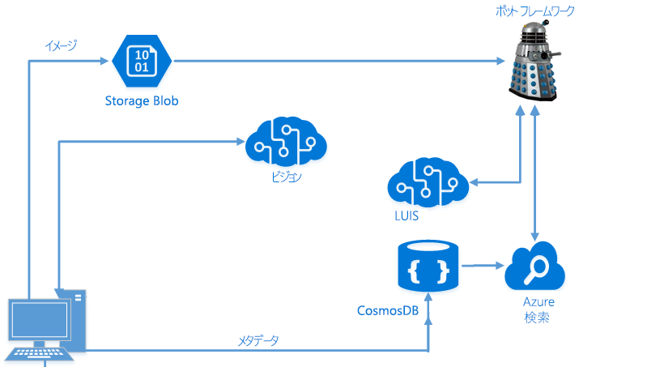

# LUIS と Azure Search を使用したインテリジェント アプリケーションの開発

このハンズオン ラボでは、Microsoft Bot Framework、Azure Search、およびマイクロソフトの Language Understanding Intelligent Service (LUIS) を使用して、エンド ツー エンドでインテリジェントなボットを作成する方法について説明します。

> **[2018/08/15] 重要な注意事項**
> Bot Framework 用の v4 SDK は最近、[公開プレビュー](https://github.com/Microsoft/botbuilder-dotnet)となりました。GA になる時期は不明です。(v3 SDK の代わりに) v4 SDK を使用して lab02.2-building_bots を完了する場合、既定のラボを 2.2 にします。
> これらの教材をクラスの一部として使用している場合 (つまり、自己学習ではない場合)、**講師の指示に従います**。
> このコースを指導する講師である場合、質問があれば、learnanalytics@microsoft.com 宛てに電子メールでお問い合わせください。

## 目的
このワークショップでは、次のことを行います。
- Azure Search 機能を実装して、アプリケーション内で肯定的な検索エクスペリエンスを提供する方法を理解する
- LUIS と Azure Search を活用する Microsoft Bot Framework を使用してインテリジェント ボットを構築する
- 正規表現とスコラブル グループを使用してボットを効率的にする

## 前提条件

このワークショップは、Azure での AI 開発者を対象としています。これは短いワークショップですので、事前に必要なことがあります。

まず、Visual Studio での経験が必要です。ワークショップで構築するすべてのものに Visual Studio を使用するので、アプリケーションを作成するために[その使用方法](https://docs.microsoft.com/ja-jp/visualstudio/ide/visual-studio-ide)に精通している必要があります。さらに、これはアプリケーションのコーディングまたは開発方法を教えるクラスではありません。C# でのコーディング方法を知っている ([ここ](https://mva.microsoft.com/ja-jp/training-courses/c-fundamentals-for-absolute-beginners-16169?l=Lvld4EQIC_2706218949)で学習できます) ものの、高度な検索および NLP (自然言語処理) ソリューションを実装する方法は知らないことを前提とします。

次に、マイクロソフトの Bot Framework を使用してボットを開発した経験が必要です。設計方法やダイアログのしくみについてディスカッションする時間はあまりありません。Bot Framework に慣れていない場合は、ワークショップに参加する前に、[この Microsoft Virtual Academy コース](https://mva.microsoft.com/ja-jp/training-courses/creating-bots-in-the-microsoft-bot-framework-using-c-17590#!)を受講する必要があります。

3 番目に、portal での経験があり、Azure でリソースを作成する (および費用をかける) ことが可能である必要があります。このワークショップでは、Azure Pass は提供しません。

>**注** このワークショップは、Visual Studio Community バージョン 15.4.0 を使用した Data Science Virtual Machine (DSVM) で開発およびテストされました。

## 紹介

独自のイメージを取り込み、Cognitive Services を使用してイメージ内のオブジェクトや人物を検索して、それらの人物がどのように感じているかを把握し、そのデータをすべて NoSQL ストア (CosmosDB) に格納することが可能なエンド ツー エンドのシナリオを構築します。この NoSQL ストアを使用して Azure Search インデックスを設定し、LUIS を使用して Bot Framework ボットを構築して、簡単なターゲットを絞ったクエリを実行できるようにします。

> **注**: このラボでは、このワークショップの前半からさまざまなラボ (Computer Vision、Azure Search、および LUIS) で得た結果の一部を組み合わせています。上記のラボを完了していない場合は、先に進む前に Azure Search と LUIS のラボを完了する必要があります。または、Azure Search/LUIS のラボからネイバーのキーの使用を要求することもできます。

## アーキテクチャ

前のラボでは、ローカル ドライブから画像を取り込み、[Computer Vision](https://www.microsoft.com/cognitive-services/ja-jp/computer-vision-api) Cognitive Services を呼び出して、タグとそれらのイメージの説明を取得できる単純な C# アプリケーションを構築しました。

このデータを取得した後でそれを処理し、[NoSQL](https://en.wikipedia.org/wiki/NoSQL) [PaaS](https://azure.microsoft.com/ja-jp/overview/what-is-paas/) オファリングである [CosmosDB](https://azure.microsoft.com/ja-jp/services/documentdb/) に必要なすべての情報を保存しました。

CosmosDB で使用した後で、それらに対して [Azure Search](https://azure.microsoft.com/ja-jp/services/search/) インデックスを作成しました。次に、クエリを実行する [Bot Framework](https://dev.botframework.com/) ボットを構築します。また、[LUIS](https://www.microsoft.com/cognitive-services/ja-jp/language-understanding-intelligent-service-luis) を使用してこのボットを拡張し、クエリから意図を自動的に抽出して、それらを使用して検索をインテリジェントに指示します。

> このラボは、この [Cognitive Services チュートリアル](https://github.com/noodlefrenzy/CognitiveServicesTutorial)を変更したものです。

## GitHub のナビゲート##

[リソース](./resources) フォルダーにはいくつかのディレクトリがあります:

- **assets**、**case**、**instructor**: このラボの目的では、これらのフォルダーを無視してかまいません。
- **code**: ここには、使用するいくつかのディレクトリがあります。
	- **Models**: これらのクラスは、PictureBot に検索を追加するときに使用されます。
	- **Finished-PictureBot_Regex**: ここには、正規表現の追加が含まれる完成した PictureBot.sln があります。進行が遅れた場合や、行き詰まってしまった場合は、これを参照できます。
	- **Finished-PictureBot_Search**: ここには、正規表現と検索の追加が含まれる完成した PictureBot.sln があります。進行が遅れた場合や、行き詰まってしまった場合は、これを参照できます。
	- **Finished-PictureBot_LUIS**: ここには、正規表現、LUIS、Azure Search の追加が含まれる完成した PictureBot.sln があります。進行が遅れた場合や、行き詰まってしまった場合は、これを参照できます。

> これらのラボを実行するには Visual Studio が必要ですが、ワークショップのいずれか用に Windows Data Science Virtual Machine を既にデプロイしている場合は、それを使用できます。

## キーの収集

このラボを通して、さまざまなキーを収集します。ワークショップ全体で簡単にアクセスできるように、それらのすべてのキーをテキスト ファイルに保存することをお勧めします。

>_Keys_
>- LUIS API:
>- Cosmos DB 接続文字列:
>- Azure Search 名:
>- Azure Search キー:
>- Bot Framework アプリ名:
>- Bot Framework アプリ ID:
>- Bot Framework アプリのパスワード:

## ラボのナビゲート

このワークショップは 5 つのセクションに分かれています。
- [1_Regex_and_ScorableGroups](./1_Regex_and_ScorableGroups.md): ここでは、正規表現とスコラブル グループを使用して、単純なボットを構築します。
- [2_Azure_Search](./2_Azure_Search.md): Azure Search 用のボットを構成し、前のラボの Azure Search サービスに接続します。
- [3_LUIS](./3_LUIS): 次に、正規表現でユーザーの意図を認識できない場合に LUIS を呼び出すことができるように、LUIS モデルをボットに組み込みます。
- [4_Publish_and_Register](./4_Publish_and_Register.md): ボットを公開して登録すると終了です。
- [5_Challenge_and_Closing](./5_Challenge_and_Closing.md): すべてのラボを通して、この課題にチャレンジしましょう。また、学習した内容の概要と詳細情報を得られる場所も示します。

### [1_Regex_and_ScorableGroups](./1_Regex_and_ScorableGroups.md) に進みましょう

