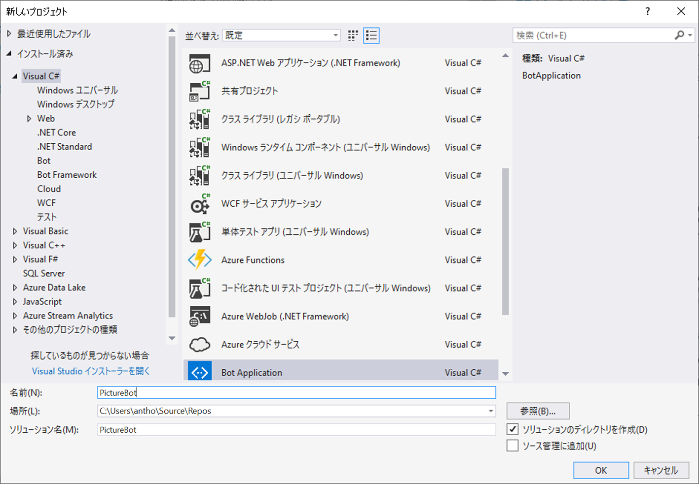
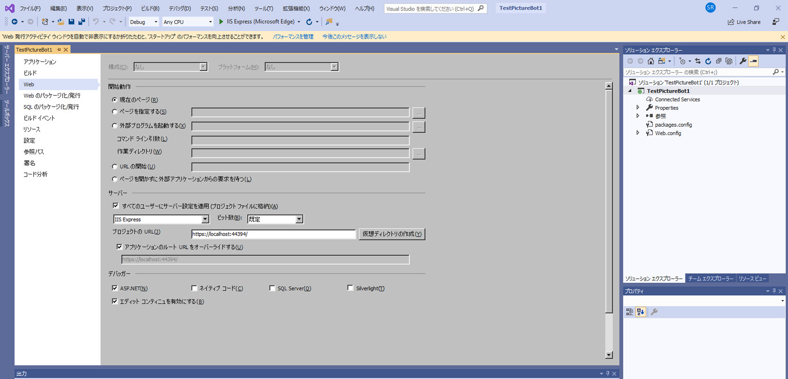

## 1_Regex_and_ScorableGroups:
想定時間: 10-15 分

## ボットの構築

Bot Framework に触れた経験があることを前提としています。経験があれば、問題ありません。経験がない場合でも、心配しすぎないでください。このセクションで十分に学習します。[この Microsoft Virtual Academy コース](https://mva.microsoft.com/ja-jp/training-courses/creating-bots-in-the-microsoft-bot-framework-using-c-17590#!)を修了し、[ドキュメント](https://docs.microsoft.com/ja-jp/bot-framework/)を確認することをお勧めします。

### ラボ 1.1: ボット開発の設定

C# SDK を使用してボットを開発します。  開始するには、次の 2 つのことが必要です。
1. Bot Framework プロジェクトのテンプレートは、[ここ](http://aka.ms/bf-bc-vstemplate)でダウンロードできます。  このファイルは "Bot Application.zip" と呼ばれ、\Documents\Visual Studio 2019\Templates\ProjectTemplates\Visual C#\ ディレクトリに保存する必要があります。  ここに zip ファイル全体をドロップするだけです。解凍する必要はありません。  
2. ボットをローカルでテストするために、Bot フレームワーク エミュレーターを[ここ](https://github.com/Microsoft/BotFramework-Emulator/releases/download/v3.5.33/botframework-emulator-Setup-3.5.33.exe)から Bot Framework Emulator をダウンロードしてください。  エミュレーターは、ブラウザーに応じて、`c:\Users\`_your-username_`\AppData\Local\botframework\app-3.5.33\botframework-emulator.exe` または Downloads フォルダーにインストールされます。

### ラボ 1.2: 単純なボットの作成と実行

Visual Studio で、「ファイル」 --> 「新しいプロジェクト」に移動し、「PictureBot」という名前のボット アプリケーションを作成します。必ず「PictureBot」という名前を付けてください。そうしないと、後で問題が発生する可能性があります。  

 

>**単純なボットを作成して実行する**ラボの残りの部分はオプションです。前提条件に従って、Bot Framework の操作経験が必要です。F5 キーを押すと、正しくビルドされていることを確認できます。次のラボに進みましょう。

サンプルのボット コードのファイルの内容を調べます。これは、メッセージとその文字数を繰り返すエコー ボットです。  特に、 **注**
+ App_Start の下の **WebApiConfig.cs** にあるルート テンプレートは api/{controller}/{id} で、ID は省略可能です。  そのため、必ず最後に API/メッセージが追加されたボットのエンドポイントを呼び出します。  
+ Controllers の下の **MessagesController.cs** は、ボットへのエントリポイントです。ボットはさまざまな種類のアクティビティに対応でき、メッセージを送信すると RootDialog が呼び出されます。  
+ Dialogs の下の **RootDialog.cs** にある "StartAsync" はユーザーからのメッセージを待機しているエントリ ポイントであり、"MessageReceiveAsync" は受信したメッセージを処理し、さらにメッセージを待機するメソッドです。  "context.PostAsync" を使用して、ボットからのメッセージをユーザーに送信します。  

F5 キーを押して、サンプル コードを実行します。  NuGet によって、適切な依存関係がが自動的にダウンロードされます。  

http://localhost:3979/ のような URL で、既定の Web ブラウザーでコードを起動します。  

> 楽しい余談: なぜこのポート番号でしょうか?  これは、プロジェクトのプロパティとして設定されます。  ソリューション エクスプローラーで、「プロパティ」をダブルクリックし、「Web」タブを選択します。  プロジェクトの URL は「サーバー」セクションで設定されます。  

 

プロジェクトがまだ実行されていることを確認し (プロジェクトのプロパティを確認するために停止した場合は、F5 キーをもう一度押す)、Bot Framework Emulator を起動します  (インストールしたばかりの場合は、ローカル コンピューターでの検索時にインデックスが表示されない可能性があるため、c:\Users\your-username\AppData\Local\botframework\app-3.5.27\botframework-emulator.exe. にインストールされていることを確認してください)。  ボットの URL が上記でコードを起動したポート番号と一致していて、最後に API/メッセージが追加されていることを確認します。  ボットと会話できる状態になっているはずです。  

 


### ラボ 1.3: 正規表現と ScorableGroups

ボットをさらに良いものにするためにできることは多数あります。何よりも、LUIS を単純な "hi" というあいさつ (ボットがかなり頻繁にユーザーから受け取る要求です) に使用したくはありません。  単純な正規表現でこれを行うことができ、時間の節約になり (ネットワークの待機時間)、費用も節約できます (LUIS サービスを呼び出すコスト)。  

また、ボットの複雑さが増し、ユーザーの入力を受け取って複数のサービスを使用して解釈するようになると、そのフローを管理するプロセスが必要になります。  たとえば、最初に正規表現を試してみて、見つからない場合は LUIS を呼び出し、その後は他のサービス、たとえば [QnA Maker](http://qnamaker.ai) や Azure Cognitive Search を試します。  これを管理する優れた方法は、[ScorableGroups](https://blog.botframework.com/2017/07/06/Scorables/) です。  ScorableGroups では、これらのサービス呼び出しの順序を指定する属性が提供されます。  このコードでは、最初に正規表現と一致する順序を指定し、次に LUIS を呼び出して発話を解釈して、最後に最も優先度が低いものを、一般的な "I'm not sure what you mean" (おっしゃっていることの意味がわかりません) という応答にドロップダウンします。    

ScorableGroups を使用するには、LuisDialog の代わりに、DispatchDialog から RootDialog を継承する必要があります (ただし、クラスに LuisModel 属性を存在させることは可能)。  また、Microsoft.Bot.Builder.Scorables (およびその他) を参照することも必要です。  したがって、RootDialog.cs ファイルで以下を追加します。

```csharp

using Microsoft.Bot.Builder.Scorables;
using System.Collections.Generic;

```

and change your class derivation to:

```csharp

    public class RootDialog : DispatchDialog<object>

```

次に、クラス内の 2 つの既存のメソッド (StartAsync と MessageReceiveAsync) を削除します。 

ScorableGroup 0 の最優先事項として、正規表現と一致する新しいメソッドをいくつか追加してみましょう。  RootDialog クラスの先頭に次の値を追加します。

```csharp

        [RegexPattern("^Hello|hello")]
        [RegexPattern("^Hi|hi")]
        [ScorableGroup(0)]
        public async Task Hello(IDialogContext context, IActivity activity)
        {
            await context.PostAsync("Hello from RegEx!  I am a Photo Organization Bot.  I can search your photos, share your photos on Twitter, and order prints of your photos.  You can ask me things like 'find pictures of food'.");
        }

        [RegexPattern("^Help|help")]
        [ScorableGroup(0)]
        public async Task Help(IDialogContext context, IActivity activity)
        {
            // ボタン メニューがあるヘルプ ダイアログを開きます  
            List<string> choices = new List<string>(new string[] { "Search Pictures", "Share Picture", "Order Prints" });
            PromptDialog.Choice<string>(context, ResumeAfterChoice, 
                new PromptOptions<string>("How can I help you?", options:choices));
        }

        private async Task ResumeAfterChoice(IDialogContext context, IAwaitable<string> result)
        {
            string choice = await result;
            
            switch (choice)
            {
                case "Search Pictures":
                    // PromptDialog.Text(context, ResumeAfterSearchTopicClarification,
                    //     "What kind of picture do you want to search for?");
                    break;
                case "Share Picture":
                    //await SharePic(context, null);
                    break;
                case "Order Prints":
                    //await OrderPic(context, null);
                    break;
                default:
                    await context.PostAsync("I'm sorry.I didn't understand you.");
                    break;
            }
        }

```

このコードは、"hi"、"hello"、および "help" で始まるユーザーの式と一致します。  F5 キーを押して、ボットをテストします。ユーザーが助けを求めると、ボットが実行できる 3 つの主要な操作 (画像の検索、画像の共有、プリントの注文) のボタンの簡単なメニューが表示されます。  

> 楽しい余談: ボットができることについてのオプションを並べたメニューを受け取るためにユーザーが「help」と入力する必要はないと主張する人もいるかもしれませんが、これはボットと最初に接触したときの既定の動作です。**見つけやすさ**はボットにとって最大の課題の 1 つです。このボットに何ができるかをユーザーに知ってもらう必要があります。  優れた[ボット設計の原則](https://docs.microsoft.com/ja-jp/bot-framework/bot-design-principles)が役立ちます。   

この設定により、Scorable Group 1 で正規表現と一致するものがない場合に、(後で) 2 回目の試行として LUIS を使用することが簡単になります。  


### [2_Azure_Search](./2_Azure_Search.md) に進みましょう  
[README](./0_README.md) に戻る
