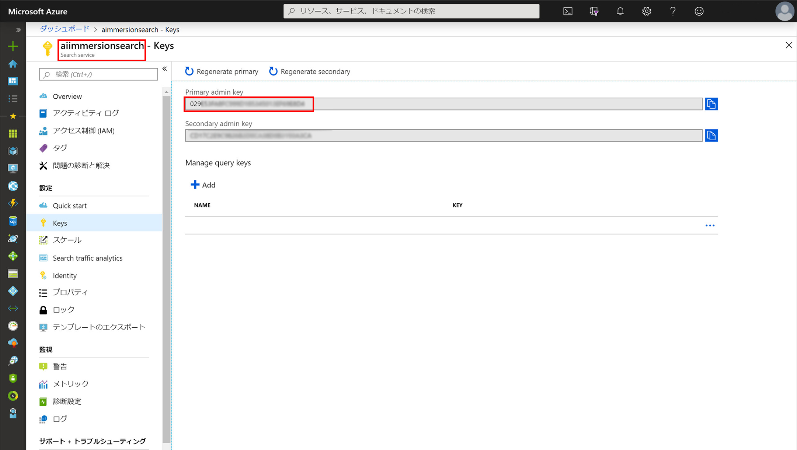
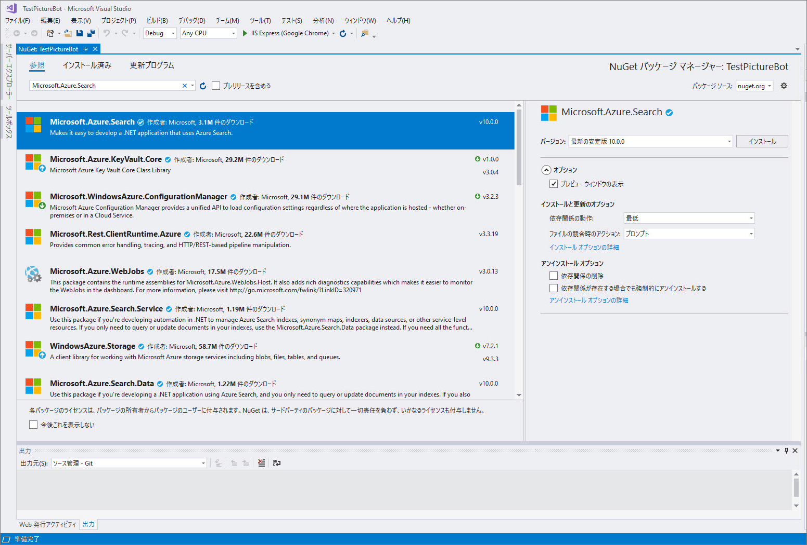

## 2 Azure Cognitive Search

想定時間: 10-15 分

### ラボ 2.1: Azure Cognitive Search 用にボットを構成する 

最初に、Azure Cognitive Search インデックスに接続するための関連情報をボットに提供する必要があります。  接続情報を格納するのに最適な場所は、構成ファイルです。  

Web.config を開き、「appSettings」セクションで以下を追加します。

```xml
    <!-- Azure Cognitive Search Settings -->
    <add key="SearchDialogsServiceName" value="" />
    <add key="SearchDialogsServiceKey" value="" />
    <add key="SearchDialogsIndexName" value="images" />
```

SearchDialogs ServiceName の値を、以前に作成した Azure Cognitive Search サービスの名前に設定します。  必要に応じて、[Azure portal](https://portal.azure.com) に戻ってこれを確認します。  

SearchDialogsServiceKey の値をこのサービスのキーに設定します。  これは、[Azure portal](https://portal.azure.com) で Azure Cognitive Search の「キー」セクションで確認できます。  次のスクリーンショットでは、SearchDialogsServiceName が「aiimmersionsearch」、SearchDialogsServiceKey が「375...」です。  

 

### ラボ 2.2: Azure Cognitive Search を使用するようにボットを更新する

次に、Azure Cognitive Search を呼び出すようにボットを更新します。  まず、「ツール」 --> 「NuGet パッケージ マネージャー」 --> 「ソリューションの NuGet パッケージの管理」を開きます。  検索ボックスに「Microsoft.Azure.Search」と入力します。  対応するライブラリを選択し、プロジェクトを示すチェックボックスをオンにしてインストールします。  他の依存関係もインストールされる可能性があります。インストールされているパッケージで、"Newtonsoft.Json" パッケージの更新が必要な場合もあります。

 

Visual Studio のソリューション エクスプローラーでプロジェクトを右クリックし、「追加」 --> 「新しいフォルダー」を選択します。  "Models" という名前のフォルダーを作成します。  次に、"Models" フォルダーを右クリックして、「追加」 > 「既存の項目」を選択します。  "Models" フォルダーにこれら 2 つのファイルを追加するには、この操作を 2 回行います (必要に応じて名前空間を調整してください)。
1. [ImageMapper.cs](./resources/code/Models/ImageMapper.cs)
2. [SearchHit.cs](./resources/code/Models/SearchHit.cs)

>このリポジトリ内のファイルは、[resources/code/Models](./resources/code/Models) にあります。

次に、Visual Studio のソリューション エクスプローラーで "Dialogs" フォルダーを右クリックし、「追加」 --> 「クラス」を選択します。  クラス "SearchDialog.cs" を呼び出します。[ここ](./resources/code/SearchDialog.cs)からコンテンツを追加します。

追加したファイルの内容を確認します。近くにいる人と何を行ったかについて話し合いましょう。

また、SearchDialog を呼び出すように RootDialog を更新する必要があります。  "Dialogs" フォルダー内の RootDialog.cs で、"ResumeAfterChoice" メソッドのすぐ下に、次の "ResumeAfter" メソッドを追加します。

```csharp

        private async Task ResumeAfterSearchTopicClarification(IDialogContext context, IAwaitable<string> result)
        {
            string searchTerm = await result;
            context.Call(new SearchDialog(searchTerm), ResumeAfterSearchDialog);
        }

        private async Task ResumeAfterSearchDialog(IDialogContext context, IAwaitable<object> result)
        {
            await context.PostAsync("Done searching pictures");
        }

```

RootDialog.cs では、以下の行からコメント (先頭に「//」がある) を削除する必要もあります。`PromptDialog.Text(context, ResumeAfterSearchTopicClarification, "What kind of picture do you want to search for?");` within the `ResumeAfterChoice` method.

F5 を押してボットを再度実行します。  Bot Emulator で、「犬」や「水」などを検索してみてください。  画像のタグが要求されたときに、結果が表示されていることを確認します。  


### [3_LUIS](./3_LUIS.md) に進みましょう  
[README](./0_README.md) に戻る
