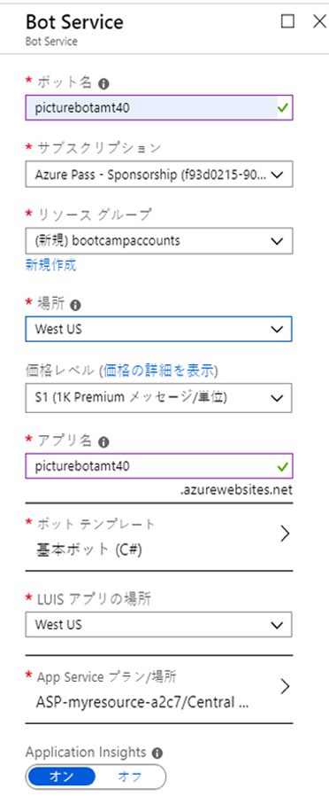
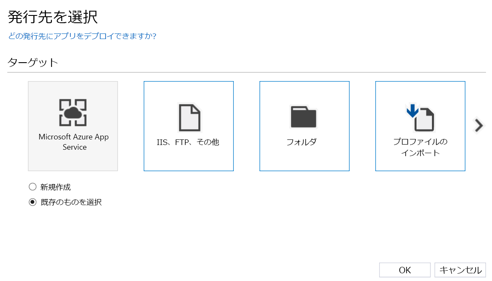
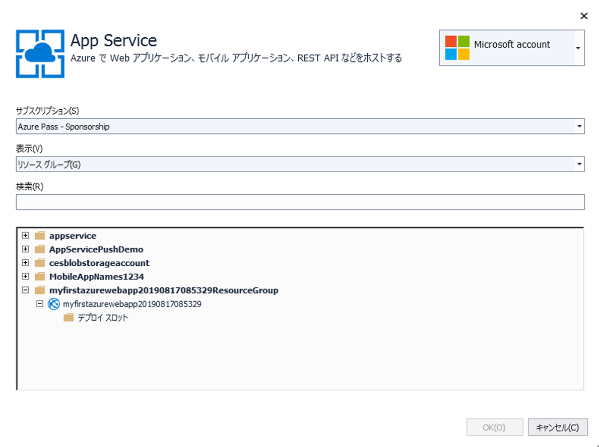
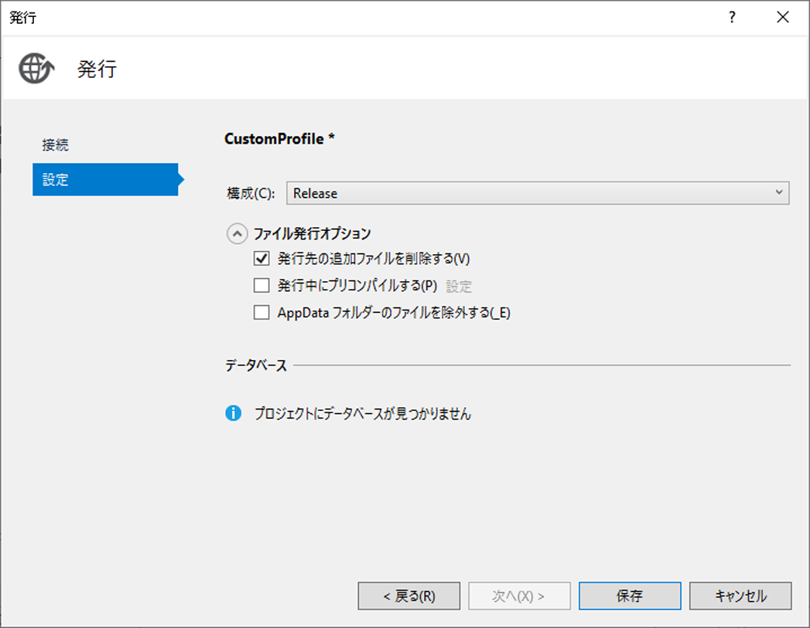

## 4_発行と登録:
予想時間: 10-15 分

### ラボ 4.1: ボットを公開する

Microsoft Bot Framework を使用して作成されたボットは、パブリック アクセス可能な任意の URL でホストできます。  このラボの目的のために、[Azure Bot Service](https://docs.microsoft.com/ja-jp/bot-framework/bot-service-overview-introduction) を使用してボットを登録します。

Portal に移動します。この portal で、「リソースの作成」をクリックして「bot」を検索します。「Web App Bot」を選択して「作成」をクリックします。名前用に、一意の識別子を作成する必要があります。PictureBot[i][n] のような規則にすることをお勧めします。[i] は自分のイニシャルで、[n] は数字です (例: PictureBotamt40)。自分に最も近いリージョンに配置します。
価格レベルについては、F0 を選択します。このワークショップではこれで十分です。ボット テンプレートを Basic (C#) に設定し、新しい App Service プランを構成します (ボットと同じ場所に配置する)。自分の PictureBot で上書きするので、どのテンプレートを選択するかは問題ではありません。Application Insights をオフにします (コストを節約するため)。「作成」をクリックします。

 

非常に単純な EchoBot を公開しました (以前に開始したテンプレートなど)。次に行うのは、PictureBot をこのボット サービスに対して公開することです。

まず、いくつかのキーを取得する必要があります。(Portal で) 作成した Web App Bot に移動します。「App Service の設定」->「アプリケーション設定」->「アプリの設定」で、BotId、MicrosoftAppId、および MicrosoftAppPassword を取得します。これらはすぐに必要になります。

Visual Studio で PictureBot に戻ります。Web.config ファイルで、`appSettings`の下の空白に「BotId」、「MicrosoftAppId」、および「MicrosoftAppPassword」と入力します。ファイルを保存します。 

> MicrosoftAppPassword に関するエラーが発生した場合、これは XML 内にあるため、キーに「&」、「<」、「>」、「'」、「"」が含まれている場合は、これらの記号をそれぞれの[エスケープ機能](https://en.wikipedia.org/wiki/XML#Characters_and_escaping)である「\&amp;」、「\&lt;」、「\&gt;」、「\&apos;」、「\&quot;」に置き換える必要があります。 

ソリューション エクスプローラーで、ボット アプリケーション プロジェクトを右クリックし、「公開」を選択します。  これにより、ボットを Azure に公開するために役立つウィザードが起動します。  

公開対象として「Microsoft Azure App Service」と「既存のものを選択」を選択します。  

 

「App Service」画面で、適切なサブスクリプション、リソース グループ、およびボット サービスを選択します。「公開」を選択します。

 

> ここでエラーが発生した場合は、Visual Studio 内のブラウザー ウィンドウを閉じて、次の手順を実行します。

これで Web 配置の設定が表示されますが、最後にもう一度編集する必要があります。公開プロファイルの下にある「設定」を選択します。もう一度「設定」を選択し、「ターゲットの追加ファイルの削除」の横にあるチェック ボックスをオンにします。「保存」をクリックしてウィンドウを閉じ、「公開」をクリックします。  Visual Studio の出力ウィンドウに、配置プロセスが表示されます。  次に、ボットが http://picturebotamt6.azurewebsites.net/ のような URL でホストされます。"picturebotamt6" はボット サービス アプリ名です。  

 

### ポータルからのボットの管理

ポータルの Web アプリ ボット リソースに戻ります。「Bot Management」 (ボットの管理) で「Test in Web Chat」 (Web チャットでテスト) を選択して、ボットが公開されていて動作しているかどうかをテストします。公開されていないか、動作していない場合は、手順をスキップした可能性があるため、前のラボを確認してください。再び公開して、ここに戻ります。

ボットが公開されていて動作していることを確認したら、「Bot Management」 (ボットの管理) の他の機能の一部を確認します。「チャネル」を選択し、多くのチャネルがあることを通知します。いずれかを選択すると、構成方法が指示されます。 

詳細な学習を希望する場合は、少し時間を取って、[方法と設計の原則](https://docs.microsoft.com/ja-jp/bot-framework/bot-service-design-principles)をお読みください。

### [5_Challenge_and_Closing](./5_Challenge_and_Closing.md) に進みましょう  
[README](./0_README.md) に戻る
