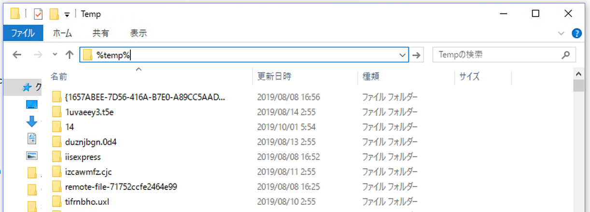

---
lab:
    title: 'ラボ 4: チャットをログに記録する'
    module: 'モジュール 2: ボットの作成'
---

# ラボ 4: チャットをログに記録する

> 前提条件: このラボは、[ラボ 3](../Lab3-Basic_Filter_Bot/02-Basic_Filter_Bot.md)でボットをビルドして公開したという前提で始まります。
このラボで説明するようにログを実装するには、このラボを実行することをお勧めします。そうでない場合、ニーズによっては、すべての演習を注意深く読み、コードの一部を調るか、独自のアプリケーションで使用するだけで十分です。

## ラボ 4.0: 目的
このワークショップでは、Microsoft Bot Framework を使用してログへの記録を実行し、チャットの会話を保存する方法について説明します。このラボを修了すると、次のことができるようになります:

- ボットとユーザーの間のメッセージ アクティビティを取得してログに記録する方法を理解する
- ファイル ストレージに発話のログを記録する

> 注: これらのラボでは、Microsoft Bot Framework SDK v4 を使用します。v3 SDK で同様のラボを実行する場合は、[ここ](./other-resources/SDK_V3_Labs)を参照してください。

## ラボ 4.1: メッセージのインターセプトと分析

このラボでは、Bot Framework で、ボットとユーザーの会話からデータをインターセプトしてログに記録できるようにするさまざまな方法について見ていきます。まず、メモリ ソリューションを実装せずに、メッセージとその内容を表示する方法を見てみましょう。これはテスト目的には適していますが、運用環境には適していません。

その後、会話からファイルにデータを書き込む方法の非常に簡単な実装について説明します。具体的には、ユーザーがボットに送信するメッセージを一覧に保存して、一覧と他のいくつかの項目を一時ファイルに保存します (ただし、必要に応じて特定のファイル パスに変更することもできます)。

#### Bot Framework Emulator を使用する

ボットに何も追加せずに、テスト目的で収集できる情報を見てみましょう。

Visual Studio で PictureBot.sln を開きます。ボットを公開したので、変更をローカルでテストするために、`PictureBot.bot`ファイルに情報を追加する必要があります。ファイルには、次の内容が表示されます。

```html
{
  "name": "PictureBot",
  "secretKey": "",
  "services": [
    {
      "appId": "",
      "id": "http://localhost:3978/api/messages",
      "type": "endpoint",
      "appPassword": "",
      "endpoint": "http://localhost:3978/api/messages",
      "name": "PictureBot"
    }
  ]
}
```

これは、v4 SDK のテンプレートから開始するときにファイルに保存される内容です。必要なのは、ボットを公開した Azure Bot Service に`appId`と`appPassword`を追加することだけです。ここで、それを行いましょう。

以前のラボで行ったように、ボットを実行し、Bot Framework Emulator でボットを開きます。

注意すべき点がいくつかあります。
- メッセージをクリックしたら、右側に表示されている "Inspector-JSON" ツールを使用すると、関連する JSON を確認できます。メッセージをクリックし、JSON を調べて、取得できる情報を確認します。
- 右下隅にある「Log」 (ログ) には、会話の完全なログが含まれています。もう少し深く掘り下げましょう。
    - 最初に表示されるのは、Emulator でリッスンしているポートです。
    - ngrok でリッスンしている場所も確認でき、"ngrok traffic inspector" リンクを使用して ngrok へのトラフィックを検査することもできます。ただし、ローカル アドレスにヒットする場合は、ngrok をバイパスすることに注意してください。**リモート テストについてはこのワークショップでは取り上げないため、ngrok につていのは情報はここには含まれていません。**
    - 呼び出しでエラーが発生した場合 (POST 200 または POST 201 という応答以外の場合)、クリックすると、"Inspector-JSON" に非常に詳細なログが表示されます。エラーの内容によっては、コードを調べて、エラーが発生した場所を特定することを試みるスタック トレースを取得できることもあります。これは、ボット プロジェクトをデバッグする場合に非常に便利です。
    - また、LUIS を呼び出すときに`Luis Trace`が発生することもわかります。`trace`リンクをクリックすると、LUIS の情報が表示されます。このラボでは、これが設定されていません。


Emulator を使用したテスト、デバッグ、およびログへの記録の詳細については、[ここ](https://docs.microsoft.com/ja-jp/azure/bot-service/bot-service-debug-emulator?view=azure-bot-service-4.0)をお読みください。

## ラボ 4.2: ファイルにログを記録する

> 注記: このラボで説明しているベスト プラクティスのいくつかを確認するために、[ドキュメントのガイダンス](https://docs.microsoft.com/ja-jp/azure/bot-service/bot-builder-howto-v4-state?view=azure-bot-service-4.0&tabs=csharp#file-storage)を参照しました。

メモリ ストレージ プロバイダーでは、ボットの再起動時に破棄されるメモリ内ストレージを使用します。これはテストのみを目的としています。データを永続化するものの、ボットをデータベースにフックしたくない場合は、ファイル ストレージ プロバイダーを使用できます。このプロバイダーはテストも目的としていますが、検査できるように、状態データをファイルに保持します。データは JSON 形式を使用してファイルに書き出されます。

このプロセスはすべてのメッセージに使用するため、Startup クラスで`ConfigureServices`メソッドを使用して、ファイルに格納情報を追加します。ファイルを開きます。現在、以下を使用していることに注意してください。

```csharp
IStorage dataStore = new MemoryStorage();
```

年間

```csharp
middleware.Add(new UserState<UserData>(dataStore));
middleware.Add(new ConversationState<ConversationInfo>(dataStore));
```

したがって、現在の実装では、メモリ内ストレージを使用します。繰り返しますが、このメモリ ストレージはローカル ボットのデバッグのみに使用することをお勧めします。ボットを再起動すると、メモリに格納されている内容はすべて消えてしまいます。

情報を一時ファイルに保存するには、現在の`IStorage`行を次のように置き換える必要があります。

```csharp
IStorage dataStore = new FileStorage(System.IO.Path.GetTempPath());
```

上記のコードを追加し、ボットを実行します。エミュレーターで、ボットとの会話のサンプルを調べて実行します。

次に、ボットを停止し、Windows デスクトップでファイル エクスプローラを開きます。ロケーション バーで、`%temp%`と入力し、キーボードの Enter キーを押します。これにより、一時ファイルの場所に移動します。最新の項目が一番上に表示されるようにコンテンツを並べ替えることをお勧めします。

探している 2 つのファイルは、"conversation" と "user" で始まります。



ファイルの内容を調べます (VSCode、Visual Studio、メモ帳、または別の JSON エディター/ビューアーを使用する)。何が表示されていますか? 表示されると思っていたのに、表示されていないのは何ですか?

## ラボ 4.3: ファイルに発話のログを記録する

このラボでは、"user" ファイルの更新のみに焦点を当てます。

次に、ユーザーがボットに送信する実際の発話を追加します。これは、ユーザーがボットを使用して完了しようとしている会話やアクションの種類を決定するのに役立ちます。

これを行うには、PictureState.cs 内の`UserData`オブジェクトに格納されている内容を更新して、PictureBot.cs 内のオブジェクトに情報を追加します。

PictureState.csで、次のコードの **後** に以下を追加します。

```csharp
public class UserData
    {

        public string Greeted { get; set; } = "not greeted";
```

以下を追加します。

```csharp
// ユーザーがボットに話した内容の一覧
public List<string> UtteranceList { get; private set; } = new List<string>();

```

上記では、ユーザーがボットに送信するメッセージを格納する一覧を簡単に作成できます。

この例では、状態マネージャーを使用してデータの読み取りと書き込みを行うことを選択していますが、[状態マネージャを使用せずにストレージから直接読み取りおよび書き込みを行う](https://docs.microsoft.com/ja-jp/azure/bot-service/bot-builder-howto-v4-storage?view=azure-bot-service-4.0&tabs=csharpechorproperty%2Ccsetagoverwrite%2Ccsetag)ことができます。


> ストレージに直接書き込むことを選択した場合は、シナリオに応じて、eTags を設定できます。eTag プロパティを`*`に設定すると、ボットの他のインスタンスによって以前に書き込まれたデータを上書きできるようになります。ここでは詳しく説明しませんが、[同時管理の詳細については、ここを参照してください](https://docs.microsoft.com/ja-jp/azure/bot-service/bot-builder-howto-v4-storage?view=azure-bot-service-4.0&tabs=csharpechorproperty%2Ccsetagoverwrite%2Ccsetag#manage-concurrency-using-etags)。

ボットを実行する前に最後に行う必要があるのは、`OnTurn`アクションを使用してメッセージを一覧に追加することです。PictureBot.cs を開きます。

PictureBot.cs で、次のコードの**後**に以下を追加します。

```csharp
public async Task OnTurn(ITurnContext context)
{

    if (context.Activity.Type is ActivityTypes.Message)
    {
        // 返されるコンテキストからユーザーと会話の状態を取得します。.
        var state = UserState<UserData>.Get(context);
        var conversationInfo = ConversationState<ConversationInfo>.Get(context);
```

以下を追加します。

```csharp
var utterance = context.Activity.Text;
state.UtteranceList.Add(utterance);
```

最初の行は、ユーザーからの受信メッセージを受け取り、`utterance`と呼ばれる変数に格納します。次の行では、PictureState.cs で作成した既存の一覧に発話を追加します。

ボットを実行し、ボットに会話のサンプルを提供します。ボットを停止して、"user" で始まる最新の一時ファイルを確認します。今度は何が表示されていますか?


>行き詰まってしまったときは? このラボのこの時点までのソリューションは、[/code/PictureBot-FinishedSolution-File](./code/PictureBot-FinishedSolution-File) にあります。Azure Bot Service のキーを`appsettings.json`ファイルに挿入する必要があります。このコードは、ソリューションとして実行するのではなく、参照として使用することをお勧めしますが、実行する場合は、必要なキーを必ず追加してください (このセクションでは、必ずしも必要はありません)。


## さらに進む

リモート ストレージとテストをログ ソリューションに組み込むには、このソリューションに基づいて構築される次の自習方式のチュートリアルをお勧めします。[Azure Storage の追加](https://github.com/Azure/LearnAI-Bootcamp/blob/master/lab02.5-logging_chat_conversations/2_Azure.md)と [Cosmos へのデータの保存](https://github.com/Azure/LearnAI-Bootcamp/blob/master/lab02.5-logging_chat_conversations/3_Cosmos.md):  
