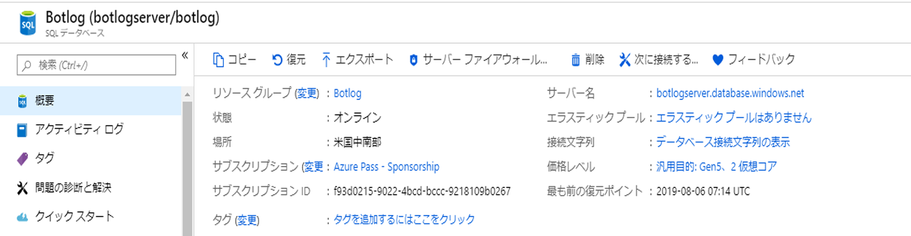
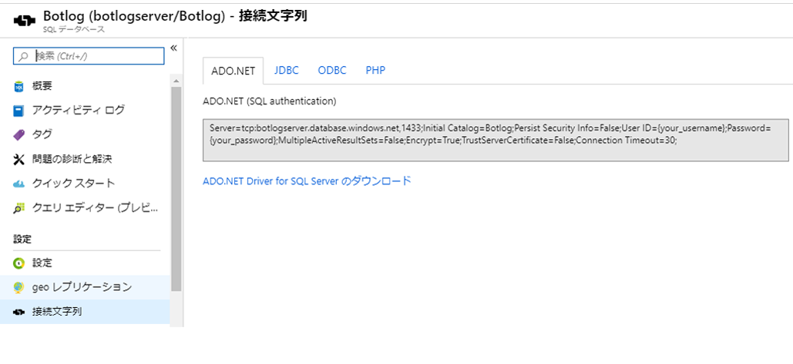
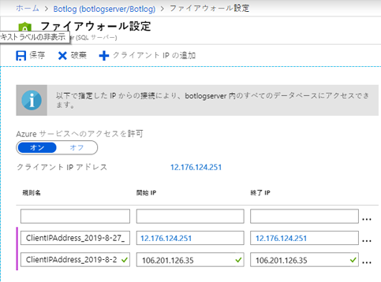
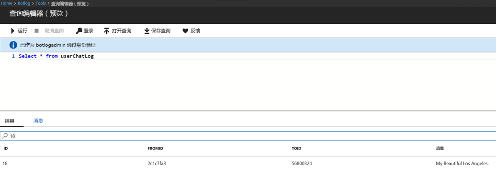

# SQL ロガー

## 1.	目的

この演習の目的は、チャットの会話をAzure SQL データベースに記録することです。このラボは、Global.asax イベントと LogAsync メソッドを使用した前の「ファイル ロガー」ラボの拡張です。

## 2.	セットアップ/前提条件

2.1.   Visual Studio の code\sql-core-Middleware からプロジェクトをインポートします。

2.2.   SQL データベースに書き込むためです。新しい SQL データベースを作成するには、Azure ポータルに移動し、[DB を作成する - Portal](https://docs.microsoft.com/ja-jp/azure/sql-database/sql-database-get-started-portal)の手順に従います。ただし、リンクに示されているように、「MySampleDatabase」ではなく、Botlog と呼ばれるデータベースを作成します。プロセスの最後に、下の図に示すように、「概要」タブが表示されるはずです。



2.2.   「概要」タブで「データベース接続文字列の表示」を選択し、ラボの後の方で使用するために、接続文字列をメモします (テキスト ドキュメントに貼り付ける)。



2.3.   ファイアウォールの設定を変更して、IP アドレスをキャプチャします。[DB を作成する - Portal](https://docs.microsoft.com/ja-jp/azure/sql-database/sql-database-get-started-portal) の手順に従った場合は、既にこれを行っている可能性があります。IP アドレスは、https://whatismyipaddress.com/ で確認できます。 



2.4.   以下の create table ステートメント (またはスキーマ) を使用して userChatLog という新しいテーブルを作成します。[DB を作成する - Portal](https://docs.microsoft.com/ja-jp/azure/sql-database/sql-database-get-started-portal) リンクの「SQL データベースに対してクエリを実行する」セクションと同じツールを使用します。Azure Portal で、左側のメニューの「データ エクスプローラー (プレビュー)」をクリックします。ログインするには、データベースの作成時に指定したのと同じアカウントとパスワードを使用します。以下のスクリプトを貼り付け、「実行」をクリックします。予想される結果は、メッセージ "クエリが成功しました: 影響を受ける行: 0." です。 

```
CREATE TABLE userChatLog(id int IDENTITY(1, 1),fromId varchar(max),toId varchar(max),message varchar(max),PRIMARY KEY(id));
```

2.5.   sql-core-Middleware から Visual Studio にコードをインポートします。これを行う最も簡単な方法は、ソリューション「sql-core-Middleware.sln」をクリックすることです。

## 3.  SQL ログ

フレームワークは、これまでのラボで使用したものとほとんど同じです。要するに、Global.asax のグローバル イベントを使用してログの記録を設定します。これを行う理想的な方法は、Application_Start によって SQL サーバーへの接続を開始し、チャット メッセージを格納するための LogAsync メソッドに接続オブジェクトを渡し、Application_End によって接続を閉じることです。

````c#
public class WebApiApplication : System.Web.HttpApplication
    {
        SqlConnection connection = null;
        protected void Application_Start()
        {
            // sql 文字列接続の設定
            SqlConnectionStringBuilder sqlbuilder = new SqlConnectionStringBuilder();
            sqlbuilder.DataSource = "botlogserver.database.windows.net";
            sqlbuilder.UserID = "botlogadmin";
            sqlbuilder.Password = "�";
            sqlbuilder.InitialCatalog = "Botlog";

            connection = new SqlConnection(sqlbuilder.ConnectionString);
            connection.Open();
            Debug.WriteLine("Connection Success");

            Conversation.UpdateContainer(builder =>
            {
                builder.RegisterType<SqlActivityLogger>().AsImplementedInterfaces().InstancePerDependency().WithParameter("conn", connection);
            });

            GlobalConfiguration.Configure(WebApiConfig.Register);
        }

        protected void Application_End()
        {
            connection.Close();
            Debug.WriteLine("Connection to database closed");
        }
    }
````

接続オブジェクトが上記のコード スニペットの SqlActivityLogger にパラメーターとして渡されることに注目してください。その結果、LogAsync メソッドで、ボットまたはユーザーからのメッセージをログに記録する準備ができました。チャット メッセージとともに、送信元と送信先の ID をアクティビティ オブジェクト (activity.From.Id, activity.Recipient.Id, activity.AsMessageActivity().Text) から取得できます。

````c#
public class SqlActivityLogger : IActivityLogger
    {
        SqlConnection connection;

        public SqlActivityLogger(SqlConnection conn)
        {
            this.connection = conn;
        }
        public async Task LogAsync(IActivity activity)
        {
                string fromId = activity.From.Id;
                string toId = activity.Recipient.Id;
                string message = activity.AsMessageActivity().Text;

                string insertQuery = "INSERT INTO userChatLog(fromId, toId, message) VALUES (@fromId,@toId,@message)";
                
                // fromId、toId、メッセージをユーザーの chatlog テーブルに渡す 
                SqlCommand command = new SqlCommand(insertQuery, connection);
                command.Parameters.AddWithValue("@fromId", fromId);
                command.Parameters.AddWithValue("@toId", toId);
                command.Parameters.AddWithValue("@message", message);
              
                // Azure sql データベースを挿入する
                command.ExecuteNonQuery();
                Debug.WriteLine("Insertion successful of message: " + activity.AsMessageActivity().Text);   
        }
    }
````

### SQL インジェクション 

SQL インジェクションとは、攻撃者が、アプリケーションのデータベース サーバーを制御する悪意のある SQL ステートメントを実行するインジェクション攻撃を指します。SQL インジェクションにより、攻撃者が機密データに不正にアクセスできるようになる可能性があります。LogAsync メソッドでは、パラメーターにより、SQL インジェクションに対する防御が可能になります。パラメータ化されたクエリの主なメリットは、SQL インジェクションを防ぐことです。

## 4.  SQL クエリの結果

Visual Studio からプロジェクトを実行し、Bot Emulator を開きます。SQL ログ機能をテストするために、ボットへのメッセージの送信を開始します。


ポータルのデータベース ページから、「ツール」->「クエリ エディター (プレビュー)」を選択して、テーブルに格納されているログ メッセージをプレビューします。ログインしてクエリを実行します。
これは結果をすばやく確認する方法ですが、唯一の方法ではありません。クエリ操作を実行するには、任意の SQL クライアントを使用してください。クエリ ````Select * from userChatLog```` を実行して、テーブル "userChatLog" に挿入されるチャットを表示します。次の例では、Bot Emulator を介して送信されるメッセージ ````My Beautiful Los Angeles```` が ID とともにログに記録されます。




### [0_README](../0_README.md) に進み、ラボを復習して、追加のクレジットを試してください