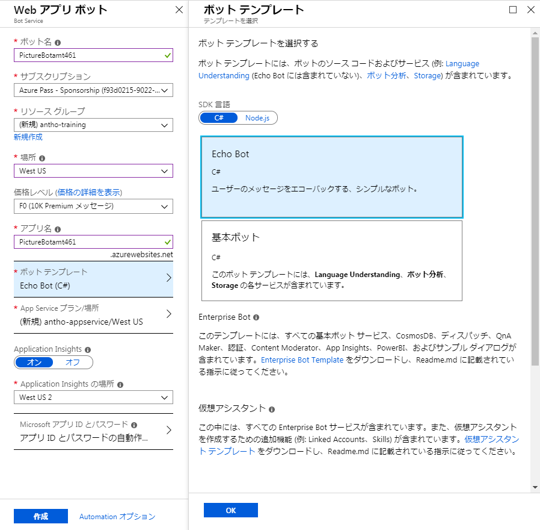
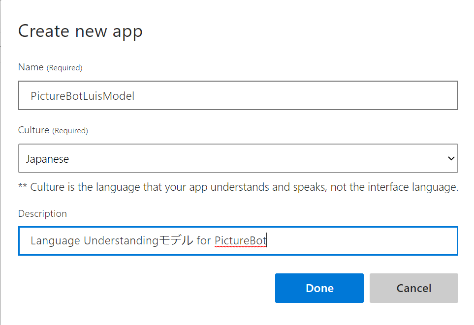
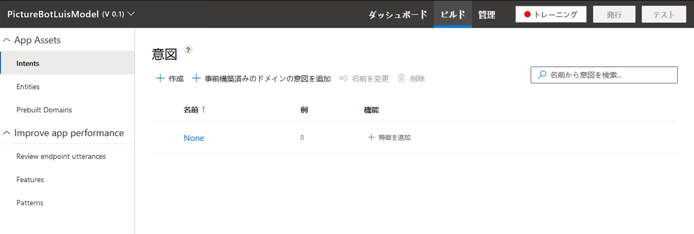
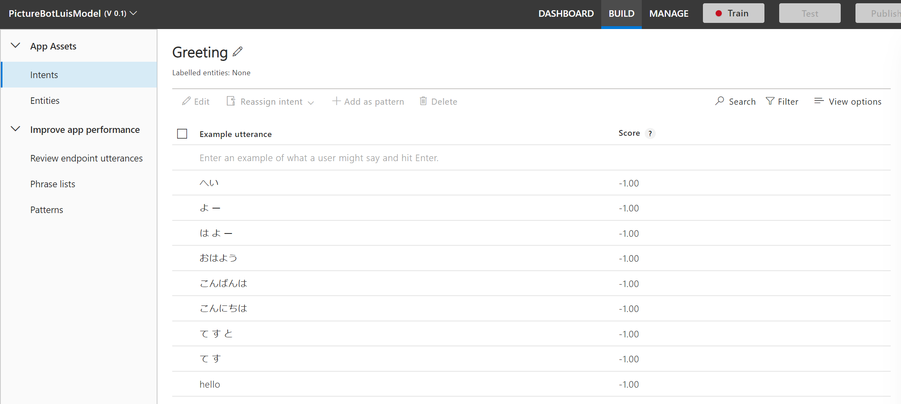
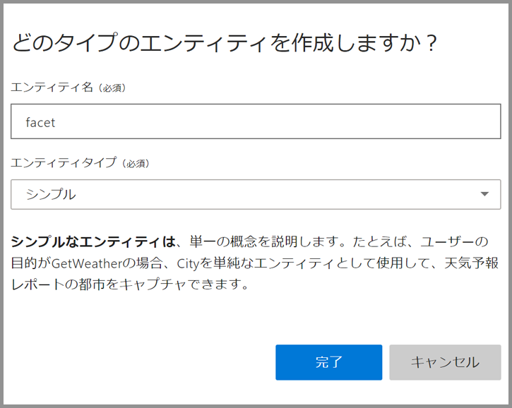

---
lab:
    title: 'ラボ 6: LUIS モデルを実装する'
    module: 'モジュール 4: LUIS を使用して Language Understanding 機能を作成する方法を学習する'
---

# ラボ 6: LUIS モデルを実装する

このハンズオン ラボでは、マイクロソフトの Language Understanding Intelligent Service (LUIS) を使用して、アプリケーションの自然言語処理機能を強化したモデルを作成する方法について説明します。

## ラボ 6.0: 目的
このラボでは、LUIS モデルの構築、トレーニング、および公開を行い、(将来のラボで作成される) ボットが人間のユーザーと効果的に通信できるようにします。

> 注記: このラボでは、今後のラボで使用する LUIS モデルのみを作成して、よりインテリジェントなボットを構築します。

## ラボ 6.1: LUIS とは

LUIS の機能については既にワークショップで説明しました。LUIS について復習するには、[詳細をお読みください](https://docs.microsoft.com/ja-jp/azure/cognitive-services/LUIS/Home)。

LUIS の概要を把握したところで、LUIS アプリを計画します。既に特定のテキストが含まれるメッセージに応答する基本的なボット ("PictureBot") を作成しています。ボットが実行できるさまざまなアクションをトリガーする意図を作成し、さまざまなアクションに必要なエンティティを作成する必要があります。たとえば、PictureBot の意図は "OrderPic" であり、適切な応答を提供するためにボットをトリガーするとします。

たとえば、「Search」の場合 (ここでは実装されません)、PictureBot の意図が "SearchPics" であり、写真を検索するために Azure Search サービスがトリガーされます。これには、検索対象を知るために "facet" エンティティが必要です。  アプリを計画するためのその他の例については、[ここ](https://docs.microsoft.com/ja-jp/azure/cognitive-services/LUIS/plan-your-app)を参照してください。

アプリについて考え抜いたら、[それを構築してトレーニングする](https://docs.microsoft.com/ja-jp/azure/cognitive-services/LUIS/luis-get-started-create-app)準備が整いました。

復習のために、LUIS アプリケーションの作成時に一般的に実行する手順は次のとおりです。

  1. [意図を追加する](https://docs.microsoft.com/ja-jp/azure/cognitive-services/LUIS/add-intents)
  2. [発話を追加する](https://docs.microsoft.com/ja-jp/azure/cognitive-services/LUIS/add-example-utterances)
  3. [エンティティを追加する](https://docs.microsoft.com/ja-jp/azure/cognitive-services/LUIS/add-entities)
  4. [フレーズ リスト](https://docs.microsoft.com/ja-jp/azure/cognitive-services/LUIS/add-features)と[パターンを使用してパフォーマンスを向上させる](https://docs.microsoft.com/ja-jp/azure/cognitive-services/LUIS/luis-how-to-model-intent-pattern)
  5. [トレーニングとテストを行う](https://docs.microsoft.com/ja-jp/azure/cognitive-services/LUIS/train-test)
  6. [エンドポイントの発話を確認する](https://docs.microsoft.com/ja-jp/azure/cognitive-services/LUIS/label-suggested-utterances)
  7. [公開する](https://docs.microsoft.com/ja-jp/azure/cognitive-services/LUIS/publishapp)

## ラボ 6.2: Portal での LUIS サービスの作成 (オプション)

> 注記: LUIS ではラボで使用できる "スターター キー" が提供されるため、Portal での LUIS サービスの作成はオプションです。ただし、Portal で無料または有料のサービスを作成する方法を確認する場合は、以下の手順に従って実行できます。

Portal で **「リソースを作成」** をクリックし、検索ボックスに **「LUIS」** と入力して、**「Language Understanding」** を選択します。

作成する API エンドポイントの詳細を入力し、目的の API と、エンドポイントを配置する場所、目的の料金プランを選択します。近くの場所に置いて、利用できるようにします。このラボでは、Free レベルで十分です。

新しい API サブスクリプションを作成したら、ブレードの適切なセクションからキーを取得し、キーの一覧に追加できます。

)

## ラボ 6.3: LUIS を使用してアプリケーションにインテリジェンスを追加する

LUIS を使用して、自然言語機能を追加する方法を見てみましょう。LUIS を使用すると、自然言語の発話 (ボットと話すときにユーザーが話す単語/フレーズ/文) を意図 (ユーザーが実行するタスクやアクション) にマッピングできます。ここでは、写真の検索、写真の共有、写真のプリントの順序付けなど、いくつかの意図があります。これらの事柄を尋ねる方法として、発話のいくつかの例をご紹介します。LUIS では、学習した内容に基づいて、それぞれの意図に追加の新しい発話がマッピングされます。

> **警告**: Azure サービスでは IE を既定のブラウザーとして使用しますが、LUIS にはお勧めしません。すべてのラボで Firefox を使用できるはずです。あるいは、[Microsoft Edge](https://www.microsoft.com/ja-jp/download/details.aspx?id=48126) または [Google Chrome](https://www.google.com/intl/en/chrome/) のいずれかをダウンロードすることもできます.

(**ヨーロッパまたはオーストラリアにお住まいの場合を除き***)、[https://www.luis.ai](https://www.luis.ai) に移動して、Microsoft アカウントを使用してサインインします  (これは、前のセクションで LUIS キーを作成したのと同じアカウントにする必要があります)。  LUIS アプリケーションの一覧にリダイレクトされるはずです。  ボットをサポートする新しい LUIS アプリを作成します。

> * **ヨーロッパ** リージョンでキーを作成した場合は、[https://eu.luis.ai/](https://eu.luis.ai/) でアプリケーションを作成する必要があります。* **オーストラリア** リージョンでキーを作成した場合は、[https://au.luis.ai/](https://au.luis.ai/) でアプリケーションを作成する必要があります。LUIS を公開しているリージョンの詳細については、[ここ](https://docs.microsoft.com/ja-jp/azure/cognitive-services/luis/luis-reference-regions)を参照してください。
&gt;
> 楽しい余談: [現在のページ](https://www.luis.ai/applications)の「New App」 (新しいアプリ) ボタンの横に「Import App」 (アプリのインポート) もあります。  LUIS アプリケーションを作成した後、アプリ全体を JSON としてエクスポートし、ソース管理にチェックインできます。  これは推奨されるベスト プラクティスであり、コードのバージョン管理に合わせて LUIS モデルのバージョンを管理できます。  エクスポートされた LUIS アプリは、「Import App」 (アプリのインポート) ボタンを使用して再インポートできます。  ラボの進行が遅れてしまい、ショートカットする場合は、「Import App」 (アプリのインポート) ボタンをクリックして [LUIS モデル](./code/LUIS/PictureBotLuisModel.json)をインポートできます。

メイン ページから「Create LUIS app」 (LUIS アプリの作成) ボタンをクリックし、次のページで国を選択して、使用許諾契約に同意し、次のページの「新しいアプリの作成」ボタンをクリックします。  名前を付けて ("PictureBotLuisModel" を選択)、「Culture」 (文化) を「English」 (英語) に設定します。  必要に応じて、説明を入力できます。次に、「完了」をクリックします。

新しいアプリの「Build」 (ビルド) セクションをが表示されます。

> "None" (なし) という意図が 1 つあることにも注意してください。  いずれの意図にもマッピングされないランダムな発話は、"None" (なし) にマッピングされる場合があります。

ボットが次のことを実行できるようにしましょう。

+ 写真を検索する
+ ソーシャル メディアで写真を共有する
+ 写真のプリントを注文する
+ ユーザーに挨拶する (ただし、これは後で説明するように、他の方法でも可能)

これらのそれぞれを要求するユーザーの意図を作成してみましょう。  「Create new intent」(新しい意図の追加) ボタンをクリックします。

最初の意図に "Greeting" という名前を付け、「完了」をクリックします。  次に、ボットに挨拶するときにユーザーが話す可能性のある言葉の例をいくつか示し、それぞれの後に Enter キーを押します。

エンティティを作成する方法を見てみましょう。  ユーザーが写真の検索を要求するとき、何を探すかを指定できます。  エンティティ内でキャプチャしてみましょう。

左側の列の「Entities」 (エンティティ) をクリックし、「Add custom entity」 (新しいエンティティの追加) をクリックします。  エンティティ名 "facet" とエンティティの種類「シンプル」を指定します。  次に、「完了」をクリックします。

次に、左側のサイドバーの「Intents」 (意図) をクリックし、「Create new intent」 (新しい意図の追加) ボタンをクリックします。  "SearchPics" という意図名を付け、「Done」 (完了) をクリックします。

"greetings" で行ったのと同じように、いくつかのサンプル発話 (ボットと話すときにユーザーが話す可能性のある単語/フレーズ/文) を追加してみましょう。  写真を検索する方法は数多くあります。  以下の発話の一部を自由に使用して、ボットに写真を検索するように依頼する方法について独自の文章を追加してください。

+ Find outdoor pics (屋外の写真を見つける)
+ Are there pictures of a train? (電車の写真はあるか)
+ Find pictures of food. (食べ物の写真を見つける)
+ Search for photos of boys playing (遊んでいる男の子の写真を検索する)
+ Give me pics of business women (働く女性の写真をください)
+ Show me beach pics (ビーチの写真を見せて)
+ I want to find dog photos (犬の写真を見つけたい)
+ Search for pictures of men indoors (屋内の男性の写真を検索する)
+ Show me pictures of men wearing glasses (眼鏡をかけている男性の写真を見せて)
+ I want to see pics of sad boys (悲しんでいる少年の写真を見たい)
+ Show me happy baby pics (幸せな赤ちゃんの写真を見せて)

いくつかの発話を用意したら、**検索トピック** を "facet" エンティティとして選択する方法を LUIS に教える必要があります。"facet" エンティティが選択するものは何でも検索されます。単語にカーソルを合わせてクリックするか、連続する単語をクリックして単語のグループを選択し、次に "facet" エンティティを選択します。

ファセットにラベルが付けられると、発話がこのようになる可能性があります。

>注記: このワークショップには Azure Search は含まれていませんが、この機能はデモンストレーションのために残されています。

次に、左側のサイドバーの「Intents」(意図) をクリックして、さらに 2 つの意図を追加します。

+ 1つの意図に **"SharePic"** という名前を付けます。  これは "この写真を共有する"、"それをツイートできますか"、"Twitter に投稿" などの発話によって識別されます。

+ **"OrderPic"** という名前の別の意図を作成します。  これは、"この写真をプリントする"、"プリントを注文したい"、"それの 8 x 10 を手に入れることができますか"、"ウォレットを注文して" などの発話でコミュニケーションできます。
発話を選択するときには、質問、命令、"...したい..." 形式の組み合わせを使用すると便利です。

最後に、"None" という意図にサンプル発話を追加する必要があります。これにより、アプリケーションのスコープ外である場合に LUIS にラベルを付けることができます。"I'm hungry for pizza" (ピザを食べたい)、"Search videos" (動画を検索) などを追加します。「None」 (なし) という意図には、アプリの発話の約 10-15% が必要です。

## ラボ 6.4: LUIS モデルのトレーニング

これで、モデルをトレーニングする準備が整いました。

右上のバーで「Train」 (トレーニング) をクリックします。  これにより、指定したトレーニング データを使用して「utterance」 (発話) --> 「intent mapping」 (意図のマッピング) を行うモデルが構築されます。トレーニングはすぐに行われるとは限りません。場合によっては、キューに入れられ、数分かかることがあります。

次に、上部バーの「管理」 (Manage) をクリックします。ウィンドウの左側には、いくつかのオプション (「Application Information」 (アプリケーション情報)、「Keys and Endpoints」 (キーとエンドポイント)、「Publish Settings」 (発行設定)、「Versions」 (バージョン)、「Collaborators」 (共同作業者)) があります。さまざまな公開オプションの詳細については、[ここ](https://docs.microsoft.com/ja-jp/azure/cognitive-services/LUIS/PublishApp)を参照してください。

Portal で LUIS サービスを作成するオプションの手順を完了した場合は、これまでに設定したエンドポイント キーを選択または追加するか (「Keys and Endpoints」 (キーとエンドポイント) タブのページの下部にある「Add Key」 (キーの追加) ボタンをクリックする)、リンク先に従って Azure アカウントからキーを追加します 
(テストと学習の目的で、"Starter_Key" だけを使用することもできます。これが LUIS サービスの作成がオプションである理由です)。エンドポイント スロットは "Production" (運用環境) のままにしておくことができます。  次に、上部バーの「Publish」 (公開) をクリックします。"Production" エンドポイントまたは "Staging" エンドポイントに公開するオプションがあります。「Production」を選択し、[2 つのエンドポイントの理由についてお読みください](https://docs.microsoft.com/ja-jp/azure/cognitive-services/luis/luis-concept-version)。次に、「Publish」 (公開) をクリックします。

公開すると、LUIS モデルを呼び出すエンドポイントが作成されます。  URL が表示されます。これについては、後のラボで説明します。ここでは、エンドポイントの URL をコピーしてキーの一覧に追加できます。

右上のバーの「Test」 (テスト) をクリックします。いくつかの発話を入力して、意図が返されることを確認してください。現在または将来のラボでこれを行う場合に備えて、[対話型のテスト](https://docs.microsoft.com/ja-jp/azure/cognitive-services/LUIS/Train-Test#interactive-testing)と[エンドポイントの発話](https://docs.microsoft.com/ja-jp/azure/cognitive-services/LUIS/luis-how-to-review-endoint-utt)に慣れておいてください。

次に、簡単な例を示します。モデルで間違って "send me a swimming photo" (水泳写真を送って) が SharePic として割り当てられていることに気付きました。これは SearchPic に割り当てる必要があります。意図を再割り当てしました。

ここで、「Train」 (トレーニング) ボタンを選択して、アプリを再トレーニングする必要があります。次に、同じ発話をテストし、今回のトレーニングと以前に公開されたモデルの結果を比較しました。モデルを使用するアプリケーションで更新を確認するには、モデルを再発行する必要があることを覚えておいてください。

`公開されたエンドポイントをブラウザーでテストする`(https://docs.microsoft.com/ja-jp/azure/cognitive-services/LUIS/PublishApp#test-your-published-endpoint-in-a-browser)こともできます。エンドポイントの URL をコピーします。ブラウザーでこの URL を開くには、URL パラメーター`&q=`をテスト クエリに設定します。たとえば、URL に`Find pictures of dogs`を追加し、Enter キーを押します。ブラウザーには、HTTP エンドポイントの JSON 応答が表示されます。

まだ時間がある場合は、www.luis.ai サイトを探索してください。「Prebuilt Domains」 (事前構築済みドメイン) を選択し、[既に利用できるものを確認してください](https://docs.microsoft.com/ja-jp/azure/cognitive-services/luis/luis-reference-prebuilt-domains)。また、[他の機能](https://docs.microsoft.com/ja-jp/azure/cognitive-services/luis/luis-concept-feature)や[パターン](https://docs.microsoft.com/ja-jp/azure/cognitive-services/luis/luis-concept-patterns)の一部を確認し、
LUIS モデルの作成、LUIS モデルの管理、会話のシミュレーションなどを行うための [BotBuilder](https://github.com/Microsoft/botbuilder-tools) ツールを確認することもできます。後で、[LUIS スキーマの設計方法が含まれる別のコース](https://aka.ms/daaia)に興味を抱くこともあるでしょう。

## さらに進む

**追加クレジット**

Azure Search が含まれる LUIS モデルの作成を試みる場合は、[検索を含めた LUIS モデル](https://github.com/Azure/LearnAI-Bootcamp/tree/master/lab01.5-luis)のトレーニングに従います。