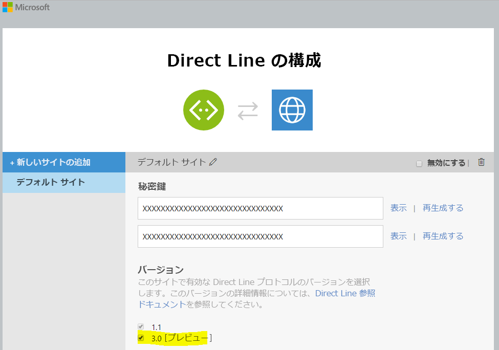

# Direct Line ボットのサンプル

サンプル ボットと、Direct Line API を使用して相互に通信するカスタム クライアント。

[![Deploy to Azure][Deploy Button]][Deploy CSharp/DirectLine]

[Deploy Button]: https://azuredeploy.net/deploybutton.png
[Deploy CSharp/DirectLine]: https://azuredeploy.net

### 前提条件

このサンプルを実行するための最小の前提条件は次のとおりです。
* Visual Studio 2015 の最新の更新プログラム。Community バージョンは[ここ](http://www.visualstudio.com)から無料でダウンロードできます。
* Bot Framework EmulatorBot Framework Emulator をインストールするには、[ここ](https://emulator.botframework.com/)からダウンロードしてください。Bot Framework Emulator の詳細については、[このドキュメントの記事](https://github.com/microsoft/botframework-emulator/wiki/Getting-Started)を参照してください。
* Microsoft Bot Framework でボットを登録します。指示については、[ここ](https://docs.microsoft.com/ja-jp/bot-framework/portal-register-bot)を参照してください。登録が完了したら、登録された設定値 (ボット ID、MicrosoftAppId、MicrosoftAppPassword) で[ボットの Web.config](DirectLineBot/Web.config#L9-L11) ファイルを更新します。

#### Direct Line API
Direct Line API の資格情報は、Bot Framework 開発者ポータルから取得する必要があり、呼び出し元だけが生成されたボットに接続できるようにします。
Bot Framework 開発者ポータルで、チャネル リスト内の Direct Line を有効にして、Direct Line シークレットを構成し、[クライアントの App.config](DirectLineClient/App.config#L4-L5) ファイルでその値をボット ID に更新します。バージョン 3.0 [「プレビュー」チェック ボックスがオンであることを確認します。チャネルの構成方法の詳細については、[ここ](https://docs.microsoft.com/ja-jp/bot-framework/portal-configure-channels)を参照してください。



#### 公開する
また、このサンプルを実行してテストするには、[たとえば、Azure にボットを公開する](https://docs.microsoft.com/ja-jp/bot-framework/publish-bot-overview)必要があります。または、[Ngrok を使用して、クラウド内のローカル ボットと対話する](https://blogs.msdn.microsoft.com/jamiedalton/2016/07/29/ms-bot-framework-ngrok/)こともできます。 

### コードのハイライト

Direct Line API は、単一のボットに直接接続するための単純な REST API です。この API は、ボットと対話する独自のクライアント アプリケーション、Web チャット コントロール、またはモバイル アプリを作成する開発者を対象としています。[Direct Line v3.0 Nuget パッケージ](https://www.nuget.org/packages/Microsoft.Bot.Connector.DirectLine/3.0.0-beta)により、基になる REST API へのアクセスが簡素化されます。

Direct Line チャネル上の各会話は、`DirectLineClient.Conversations.StartConversationAsync`を使用して明示的に開始する必要があります。
新しい `DirectLineClient`を作成し、新しい会話を開始するクライアントの `Program.cs`(DirectLineClient/Program.cs#L25-L27) クラスを確認してください。


````C#
DirectLineClient client = new DirectLineClient(directLineSecret);
            
var conversation = await client.Conversations.StartConversationAsync();
````

ユーザー メッセージは、前の手順で生成された`ConversationId`を使用する Direct Line クライアントの`Conversations.PostActivityAsync`メソッドを使用してボットに送信されます。

````C#
while (true)
{
    string input = Console.ReadLine().Trim();

    if (input.ToLower() == "exit")
    {
        break;
    }
    else
    {
        if (input.Length > 0)
        {
            Activity userMessage = new Activity
            {
                From = new ChannelAccount(fromUser),
                Text = input,
                Type = ActivityTypes.Message
            };

            await client.Conversations.PostActivityAsync(conversation.ConversationId, userMessage);
        }
    }
}
````

ボットからのメッセージは、`ReadBotMessagesAsync`メソッドの別のスレッドで API から継続的にポーリングされます。保存されている透かしよりも新しい会話メッセージを取得する`GetActivityAsync`メソッドの [Program.cs](DirectLineClient/Program.cs#L64-L69) の使用法を確認してください。アクティビティがフィルター処理され、ボットからのメッセージのみを受信できます。

````C#
var activitySet = await client.Conversations.GetActivitiesAsync(conversationId, watermark);
watermark = activitySet?.Watermark;

var activities = from x in activitySet.Activities
                    where x.From.Id == botId
                    select x;
````

DirectLine v3.0 (バージョン 1.1 とは異なる) では添付ファイルがサポートされます (添付ファイルの詳細については、[メッセージにメディア添付ファイルを追加する](https://docs.microsoft.com/ja-jp/bot-framework/dotnet/bot-builder-dotnet-add-media-attachments)を参照してください)。[Program.cs](DirectLineClient/Program.cs#L75-L92) の`ReadBotMessagesAsync`メソッドを確認して、添付ファイルの種類に基づいて添付ファイルを適切に取得およびレンダリングする方法を確認してください。


````C#
if (activity.Attachments != null)
{
    foreach (Attachment attachment in activity.Attachments)
    {
        switch (attachment.ContentType)
        {
            case "application/vnd.microsoft.card.hero":
                RenderHeroCard(attachment);
                break;

            case "image/png":
                Console.WriteLine($"Opening the requested image '{attachment.ContentUrl}'");

                Process.Start(attachment.ContentUrl);
                break;
        }
    }
}
````


### 結果

サンプルを実行するには、ボット アプリとクライアント アプリの両方を実行する必要があります。
* ボット アプリの実行
    1. Visual Studio の「ソリューション エクスプローラー」ウィンドウで、**DirectLineBot** プロジェクトを右クリックします。
    2. コンテキスト メニューで「デバッグ」を選択し、「新しいインスタンスを開始」を選択して、_Web アプリケーション_の起動を待機します。
* クライアント アプリの実行
    1. Visual Studio の「ソリューション エクスプローラー」ウィンドウで、**DirectLineSampleClient** プロジェクトを右クリックします。
    2. コンテキスト メニューで「デバッグ」を選択し、「新しいインスタンスを開始」を選択して、_コンソール アプリケーション_の起動を待機します。

添付ファイルをテストするには、`show me a hero card` (ヒーロー カードを表示) または`send me a botframework image` (ボットフレームワーク画像を送信) と入力すると、次の結果が表示されるはずです。


### 詳細情報

.NET 用の Bot Builder および会話の使用方法の詳細については、次のリソースを参照してください。
* [.NET 用の Bot Builder](https://docs.microsoft.com/ja-jp/bot-framework/dotnet/)
* [Bot Framework に関するよくある質問](https://docs.microsoft.com/ja-jp/bot-framework/resources-bot-framework-faq#i-have-a-communication-channel-id-like-to-be-configurable-with-bot-framework-can-i-work-with-microsoft-to-do-that)
* [Direct Line API - v3.0](https://docs.botframework.com/ja-jp/restapi/directline3/)
* [Direct Line v3.0 Nuget パッケージ](https://www.nuget.org/packages/Microsoft.Bot.Connector.DirectLine/3.0.0-beta)
* [メッセージにメディアの添付ファイルを追加する](https://docs.microsoft.com/ja-jp/bot-framework/dotnet/bot-builder-dotnet-add-media-attachments)
* [Bot Framework Emulator](https://github.com/microsoft/botframework-emulator/wiki/Getting-Started)
