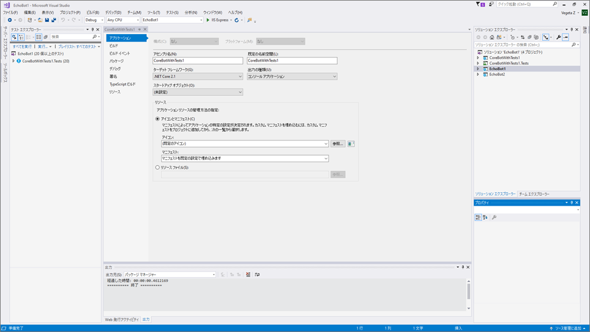
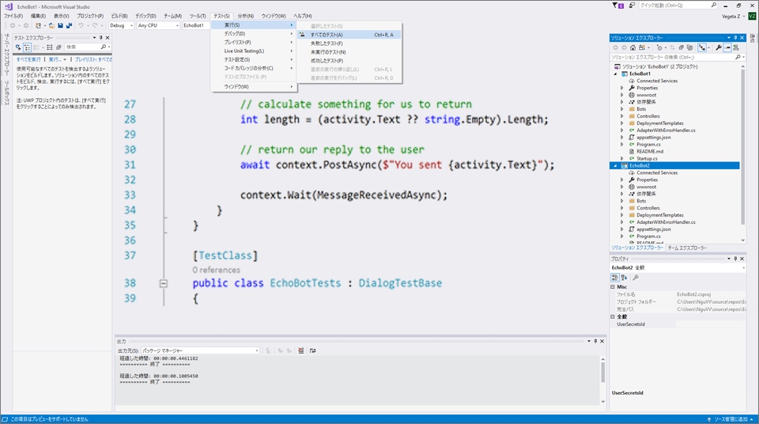

# ボットの単体テスト

## 1.	目的

Microsoft Bot Framework を使用してコードを記述することは、楽しくてエキサイティングです。しかし、ボットのコーディングを急ぐ前に、コードの単体テストについて考える必要があります。チャットボットは、環境間でのテスト、サードパーティの API の統合など、独自の課題を抱えています。単体テストは、ソフトウェア アプリケーションの個々のユニット/コンポーネントをテストするソフトウェア テスト方法です。

単体テストは次の点で役立ちます。

* 追加時に機能を確認する
* コンポーネントを単独で検証する
* コードに慣れていないユーザーは、コードを使用しているときにコードを壊していないことを確認します。

このラボの目的は、Microsoft Bot Framework を使用して開発されたボットの単体テストを導入することです。

## 2.	セットアップ

code\EchoBot から VisualStudio の EchoBot ソリューションをインポートします。正常にインポートされると、次に示すように、2 つのプロジェクト (EchoBot、ボット アプリケーションと EchoBotTests、テスト プロジェクト) が表示されます。



## 3.	EchoBot

このラボでは、EchoBot を使用して単体テストを開発します。EchoBot は、入力されたメッセージでユーザーにエコーバックする非常にシンプルなボットです。たとえば、ユーザーが "Hello" と入力した場合、EchoBot はメッセージ "You sent: Hello" で応答します。Dialogs を使用する EchoBot コードのコアが以下に存在しています (MessagesController.cs)。MessageReceivedAsync は、ユーザーに"You said: " とエコーを返します。

````c#
public class EchoDialog : IDialog<object>
{
    public async Task StartAsync(IDialogContext context)
    {
        context.Wait(MessageReceivedAsync);
    }

public async Task MessageReceivedAsync(IDialogContext context, IAwaitable<IMessageActivity> argument)
    {
        var message = await argument;
        await context.PostAsync("You said: " + message.Text);
        context.Wait(MessageReceivedAsync);
    }
}
````

## 4.	EchoBot - 単体テスト

複雑なチャットボットでは、会話の状態と会話フローについて懸念があります。また、チャットボットは 1 つのユーザー メッセージに対して複数回応答でき、メッセージを送信した後は、すぐには応答を受け取らないという事実もあります。これらの複雑さを考えると、モックは単体テストに役立ちます。モックは、主に単体テストで使用されます。テスト対象のオブジェクトは、他の (複雑な) オブジェクトに依存している可能性があります。テストするオブジェクトの動作を分離するには、他のオブジェクトを、実際のオブジェクトの動作をシミュレートするモックに置き換えます。これは、実際のオブジェクトを単体テストに組み込むのが実用的でない場合に便利です。

単体テストは、EchoBot ソリューション内の Visual Studio の *単体テスト プロジェクト* を使用して作成できます。EchoBot.sln のインポート時に、単体テスト プロジェクトである EchoBotTests プロジェクトが表示されます。このプロジェクトには、ダイアログの単体テストの開発に役立つヘルパー クラス (Bot Builder コードを再利用して開発) がいくつか含まれています。

* DialogTestBase.cs
* FiberTestBase.cs
* MockConnectorFactory.cs

EchoBotTests.cs の中には、*ShouldReturnEcho* と呼ばれる Test メソッドがあります。*ShouldReturnEcho* では、EchoBot の結果を検証します。EchoBotTests.cs の次の行では、RootDialog を使用して EchoBot の動作を模倣します。RootDialog は、EchoBot の機能を提供するために使用されます。

````c#
using (new FiberTestBase.ResolveMoqAssembly(rootDialog))
````

次に示すように、**「テスト」->「実行」->「すべてのテスト」** を選択してすべてのテストを実行し、テストが正常に実行されていることを確認します。



## 5.	予定より早く終了した場合追加クレジットのために、この演習をお試しください。

A.   "You sent" で始まるエコー プロンプトを検証する *EchoStartsWith* と呼ばれる別の TestMethod を記述します。

*ヒント:* TestMethod は ShouldReturnEcho() と非常によく似ており、toUser.text が "You sent" で始まるかどうかを確認します。

B.   エコーされたメッセージがボットによって送信されたことを確認できますか?

*ヒント:* これには、受信した IMessageActivity 応答のプロパティを確認する必要があります。


 ### [3_Direct_Line_Testing](3_Direct_Line_Testing.md) に進みましょう

 [README](../0_README.md) に戻る